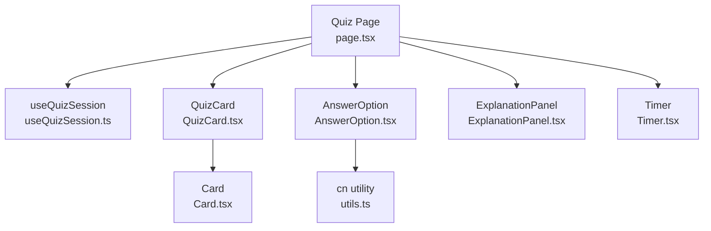
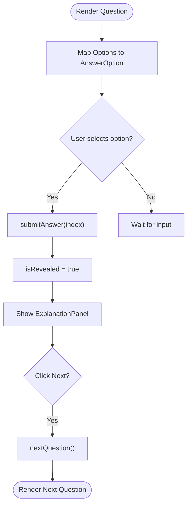
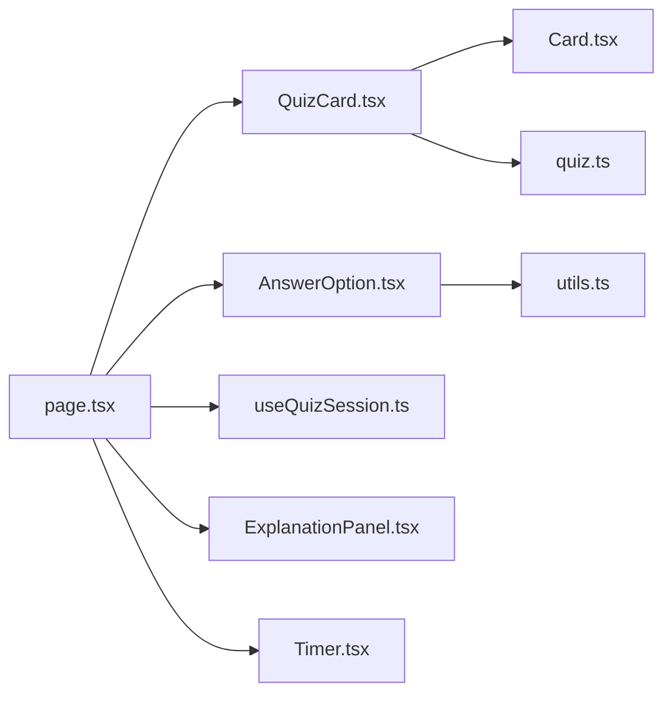

# Question Display Components

<cite>
**Referenced Files in This Document**
- [QuizCard.tsx](file://Next-app/src/components/quiz/QuizCard.tsx)
- [AnswerOption.tsx](file://Next-app/src/components/quiz/AnswerOption.tsx)
- [page.tsx](file://Next-app/src/app/(dashboard)/quiz/page.tsx)
- [useQuizSession.ts](file://Next-app/src/lib/hooks/useQuizSession.ts)
- [quiz.ts](file://Next-app/src/types/quiz.ts)
- [Card.tsx](file://Next-app/src/components/ui/Card.tsx)
- [ExplanationPanel.tsx](file://Next-app/src/components/quiz/ExplanationPanel.tsx)
- [Timer.tsx](file://Next-app/src/components/quiz/Timer.tsx)
- [utils.ts](file://Next-app/src/lib/utils.ts)
</cite>

## Table of Contents
1. Introduction
2. Project Structure
3. Core Components
4. Architecture Overview
5. Detailed Component Analysis
6. Dependency Analysis
7. Performance Considerations
8. Troubleshooting Guide
9. Conclusion
10. Appendices

## Introduction
This document explains the question display components used in the quiz feature: QuizCard and AnswerOption. It covers how QuizCard renders individual questions with proper formatting, how AnswerOption displays selectable answers with visual feedback and selection states, and how user interactions are handled end-to-end. It also includes guidance for customizing layouts, adding multimedia content, implementing keyboard navigation, styling options, responsive design considerations, and mobile touch interactions.

## Project Structure
The quiz UI is implemented as a Next.js client component that composes reusable UI primitives and domain-specific components:
- The quiz page orchestrates state via a custom hook and renders QuizCard and AnswerOption to present questions and choices.
- QuizCard wraps the question text using a shared Card primitive.
- AnswerOption provides interactive answer buttons with visual states (selected, correct, incorrect, disabled).
- Supporting components include ExplanationPanel for post-answer feedback and Timer for elapsed time tracking.



**Diagram sources**
- [page.tsx:1-185](file://Next-app/src/app/(dashboard)/quiz/page.tsx#L1-L185)
- [useQuizSession.ts:1-157](file://Next-app/src/lib/hooks/useQuizSession.ts#L1-L157)
- [QuizCard.tsx:1-19](file://Next-app/src/components/quiz/QuizCard.tsx#L1-L19)
- [AnswerOption.tsx:1-70](file://Next-app/src/components/quiz/AnswerOption.tsx#L1-L70)
- [Card.tsx:1-25](file://Next-app/src/components/ui/Card.tsx#L1-L25)
- [ExplanationPanel.tsx:1-44](file://Next-app/src/components/quiz/ExplanationPanel.tsx#L1-L44)
- [Timer.tsx:1-31](file://Next-app/src/components/quiz/Timer.tsx#L1-L31)
- [utils.ts:1-27](file://Next-app/src/lib/utils.ts#L1-L27)

**Section sources**
- [page.tsx:1-185](file://Next-app/src/app/(dashboard)/quiz/page.tsx#L1-L185)
- [useQuizSession.ts:1-157](file://Next-app/src/lib/hooks/useQuizSession.ts#L1-L157)

## Core Components
- QuizCard: Renders a single question with its number and text inside a styled card container. It receives a Question object and a questionNumber prop.
- AnswerOption: Renders a selectable answer button with visual states for selected, revealed/correct, revealed/incorrect, and disabled. It uses an option letter label and supports click-based selection.

Key behaviors:
- QuizCard formats the question number and text consistently across the quiz flow.
- AnswerOption computes border/background styles based on props (selected, correct, revealed, disabled) and triggers onSelect(index) when clicked.

**Section sources**
- [QuizCard.tsx:1-19](file://Next-app/src/components/quiz/QuizCard.tsx#L1-L19)
- [AnswerOption.tsx:1-70](file://Next-app/src/components/quiz/AnswerOption.tsx#L1-L70)
- [quiz.ts:1-47](file://Next-app/src/types/quiz.ts#L1-L47)

## Architecture Overview
The quiz page manages session state through useQuizSession, which controls loading, active answering, revealing answers, and finishing. The page renders:
- A header with a timer
- A progress bar
- QuizCard for the current question
- A list of AnswerOption components for each choice
- An ExplanationPanel after an answer is submitted
- A next/results button controlled by the hook’s state

```mermaid
sequenceDiagram
participant User as "User"
participant Page as "Quiz Page"
participant Hook as "useQuizSession"
participant API as "API /api/quiz/generate"
participant Card as "QuizCard"
participant Option as "AnswerOption"
participant Explain as "ExplanationPanel"
User->>Page : Start quiz
Page->>Hook : startQuiz(config)
Hook->>API : POST generate questions
API-->>Hook : Questions[]
Hook-->>Page : status=active, questions, currentIndex=0
loop For each question
Page->>Card : Render currentQuestion
Page->>Option : Render options with selected/revealed/disabled
User->>Option : Click option
Option->>Page : onSelect(index)
Page->>Hook : submitAnswer(index)
Hook-->>Page : isRevealed=true, answers updated
Page->>Explain : Show explanation if revealed
User->>Page : Click Next
Page->>Hook : nextQuestion()
end
Hook-->>Page : status=finished
Page->>Page : Show results
```

**Diagram sources**
- [page.tsx:18-185](file://Next-app/src/app/(dashboard)/quiz/page.tsx#L18-L185)
- [useQuizSession.ts:20-157](file://Next-app/src/lib/hooks/useQuizSession.ts#L20-L157)
- [QuizCard.tsx:9-18](file://Next-app/src/components/quiz/QuizCard.tsx#L9-L18)
- [AnswerOption.tsx:15-69](file://Next-app/src/components/quiz/AnswerOption.tsx#L15-L69)
- [ExplanationPanel.tsx:10-43](file://Next-app/src/components/quiz/ExplanationPanel.tsx#L10-L43)

## Detailed Component Analysis

### QuizCard
Responsibilities:
- Displays the question number and question text within a consistent card layout.
- Uses a shared Card primitive for consistent spacing, borders, and background.

Props:
- question: Provides the text and metadata from the Question type.
- questionNumber: Numeric index used to prefix the question.

Rendering behavior:
- Wraps the question text in a readable paragraph with bold styling and adds a colored question number prefix.

Accessibility and UX notes:
- As a presentational component, it does not handle interactions. Ensure surrounding components manage focus and keyboard navigation for the full question block.

Customization ideas:
- Add multimedia (images, diagrams) by extending the component to accept optional media props and rendering them above or below the question text.
- Adjust typography or spacing via className overrides passed to the underlying Card.

**Section sources**
- [QuizCard.tsx:1-19](file://Next-app/src/components/quiz/QuizCard.tsx#L1-L19)
- [Card.tsx:1-25](file://Next-app/src/components/ui/Card.tsx#L1-L25)
- [quiz.ts:1-9](file://Next-app/src/types/quiz.ts#L1-L9)

### AnswerOption
Responsibilities:
- Renders a clickable answer option with visual feedback for selection, correctness, and disabled states.
- Communicates user selection back to the parent via onSelect(index).

Props:
- label: The text of the option.
- index: Positional identifier used to report selection.
- selected: Whether this option is currently chosen by the user.
- correct: Whether this option is the correct answer.
- revealed: Whether the answer has been revealed (post-submission).
- disabled: Prevents interaction during review or while locked.
- onSelect: Callback invoked with the option’s index.

Visual states:
- Default: neutral border and background with hover effect when enabled.
- Selected: highlighted border and subtle background tint.
- Revealed + Correct: success-colored border and background; option letter badge becomes success-colored.
- Revealed + Incorrect (user selected wrong): error-colored border and background; option letter badge becomes error-colored.

Interaction model:
- onClick triggers onSelect(index).
- When disabled, the button remains visible but non-interactive with reduced opacity.

Accessibility and UX notes:
- Uses a native <button>, ensuring keyboard operability by default.
- To improve accessibility, consider adding aria attributes such as aria-pressed for selection state and aria-disabled for disabled state.
- Provide clear focus indicators and ensure sufficient color contrast for all states.

Keyboard navigation:
- Users can tab between options and press Enter/Space to select.
- Arrow keys can be added to move focus between options for better keyboard flow.

Styling customization:
- Use the cn utility to merge additional classes for theme-aware styling.
- Override colors via CSS variables or Tailwind theme tokens to match brand guidelines.

Responsive and mobile considerations:
- The button spans full width and stacks vertically, suitable for mobile screens.
- Touch targets are large enough for comfortable tapping.
- Ensure adequate spacing between options to prevent accidental taps.

**Section sources**
- [AnswerOption.tsx:1-70](file://Next-app/src/components/quiz/AnswerOption.tsx#L1-L70)
- [utils.ts:1-6](file://Next-app/src/lib/utils.ts#L1-L6)

### Integration in the Quiz Page
The quiz page wires up QuizCard and AnswerOption with session state:
- Starts the quiz by fetching questions via the API and setting status to active.
- Renders the current question with QuizCard and maps options to AnswerOption instances.
- On option selection, calls submitAnswer to reveal correctness and show ExplanationPanel.
- Advances to the next question or shows results upon completion.



**Diagram sources**
- [page.tsx:44-75](file://Next-app/src/app/(dashboard)/quiz/page.tsx#L44-L75)
- [useQuizSession.ts:83-123](file://Next-app/src/lib/hooks/useQuizSession.ts#L83-L123)
- [ExplanationPanel.tsx:10-43](file://Next-app/src/components/quiz/ExplanationPanel.tsx#L10-L43)

**Section sources**
- [page.tsx:18-185](file://Next-app/src/app/(dashboard)/quiz/page.tsx#L18-L185)
- [useQuizSession.ts:20-157](file://Next-app/src/lib/hooks/useQuizSession.ts#L20-L157)

## Dependency Analysis
- QuizCard depends on:
  - Card primitive for layout and styling.
  - Question type for data shape.
- AnswerOption depends on:
  - cn utility for class merging.
  - Props driven by the quiz page and hook state.
- Quiz page depends on:
  - useQuizSession hook for state and side effects.
  - Timer for elapsed time display.
  - ExplanationPanel for post-answer feedback.
  - Types from quiz.ts for strong typing.



**Diagram sources**
- [QuizCard.tsx:1-19](file://Next-app/src/components/quiz/QuizCard.tsx#L1-L19)
- [AnswerOption.tsx:1-70](file://Next-app/src/components/quiz/AnswerOption.tsx#L1-L70)
- [page.tsx:1-185](file://Next-app/src/app/(dashboard)/quiz/page.tsx#L1-L185)
- [useQuizSession.ts:1-157](file://Next-app/src/lib/hooks/useQuizSession.ts#L1-L157)
- [Card.tsx:1-25](file://Next-app/src/components/ui/Card.tsx#L1-L25)
- [ExplanationPanel.tsx:1-44](file://Next-app/src/components/quiz/ExplanationPanel.tsx#L1-L44)
- [Timer.tsx:1-31](file://Next-app/src/components/quiz/Timer.tsx#L1-L31)
- [utils.ts:1-27](file://Next-app/src/lib/utils.ts#L1-L27)
- [quiz.ts:1-47](file://Next-app/src/types/quiz.ts#L1-L47)

**Section sources**
- [page.tsx:1-185](file://Next-app/src/app/(dashboard)/quiz/page.tsx#L1-L185)
- [useQuizSession.ts:1-157](file://Next-app/src/lib/hooks/useQuizSession.ts#L1-L157)

## Performance Considerations
- Rendering efficiency:
  - AnswerOption is lightweight and re-renders only when props change. Avoid unnecessary re-renders by memoizing derived values in the parent if needed.
- State updates:
  - useQuizSession batches state changes per action (submitAnswer, nextQuestion), minimizing re-renders.
- Network calls:
  - Quiz generation occurs once at start; subsequent interactions are local until the final submission.
- Accessibility and responsiveness:
  - Large touch targets and full-width buttons reduce mis-taps on mobile.
  - Clear visual states help users quickly understand their progress and correctness.

[No sources needed since this section provides general guidance]

## Troubleshooting Guide
Common issues and resolutions:
- Options do not react to clicks:
  - Verify that disabled is false when user should interact.
  - Ensure onSelect is passed correctly from the parent and not overridden.
- Incorrect visual state after submission:
  - Confirm that correct is computed against the current question’s correctAnswer and that revealed reflects the hook’s isRevealed state.
- No explanation shown:
  - Check that isRevealed is true and selectedAnswer is set before rendering ExplanationPanel.
- Timer not updating:
  - Ensure running prop is true during active phases and that the hook’s timer logic is active.

**Section sources**
- [AnswerOption.tsx:15-69](file://Next-app/src/components/quiz/AnswerOption.tsx#L15-L69)
- [page.tsx:44-167](file://Next-app/src/app/(dashboard)/quiz/page.tsx#L44-L167)
- [useQuizSession.ts:83-123](file://Next-app/src/lib/hooks/useQuizSession.ts#L83-L123)
- [Timer.tsx:12-31](file://Next-app/src/components/quiz/Timer.tsx#L12-L31)

## Conclusion
QuizCard and AnswerOption form the core of the quiz experience, providing clear question presentation and intuitive answer selection with immediate feedback. The quiz page orchestrates these components with a robust session hook, enabling smooth transitions between questions, explanations, and results. By following the customization and accessibility recommendations outlined here, you can extend these components to support multimedia, enhanced keyboard navigation, and responsive designs tailored for mobile and desktop users.

[No sources needed since this section summarizes without analyzing specific files]

## Appendices

### Customization Examples
- Adding multimedia to QuizCard:
  - Extend props to accept image URLs or rich content and render them conditionally above the question text.
  - Use responsive image techniques and lazy loading for performance.
- Enhancing AnswerOption with keyboard navigation:
  - Implement arrow key handling in the parent to move focus between options.
  - Add aria-pressed and aria-disabled attributes for screen readers.
- Styling options:
  - Use the cn utility to merge theme-aware classes.
  - Define semantic tokens for borders, backgrounds, and text colors to maintain consistency.

[No sources needed since this section provides general guidance]

### Responsive Design and Mobile Touch Interactions
- Layout:
  - Full-width buttons stack vertically for readability on small screens.
  - Adequate padding and margins prevent accidental touches.
- Touch targets:
  - Ensure minimum tap target sizes for accessibility and usability.
- Visual feedback:
  - Distinct colors and borders for selected, correct, and incorrect states aid quick comprehension.

[No sources needed since this section provides general guidance]