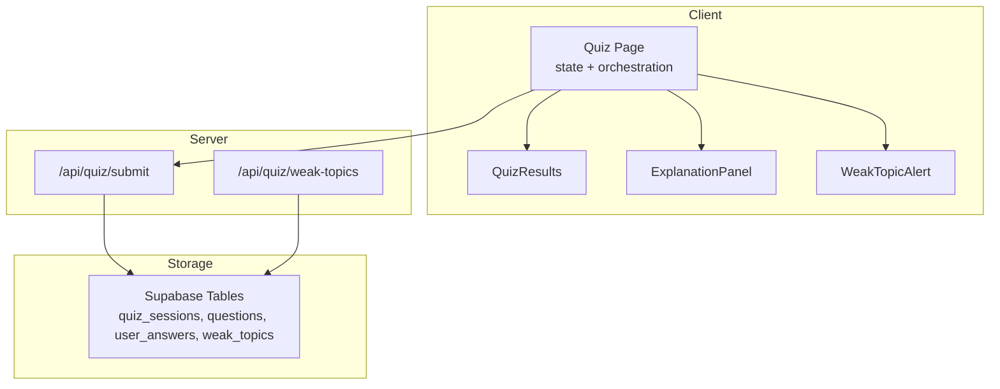
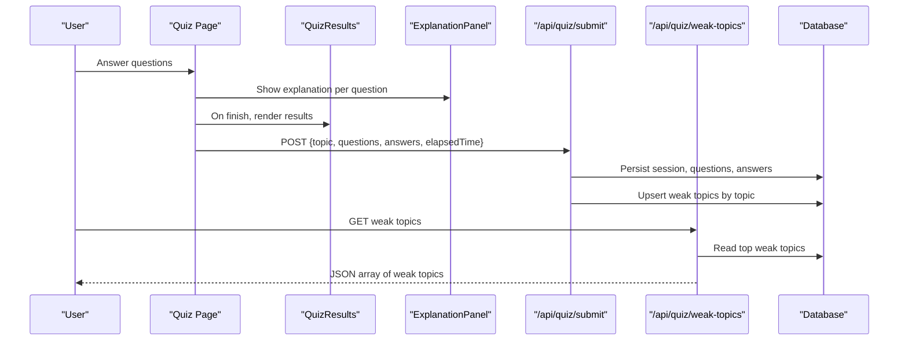
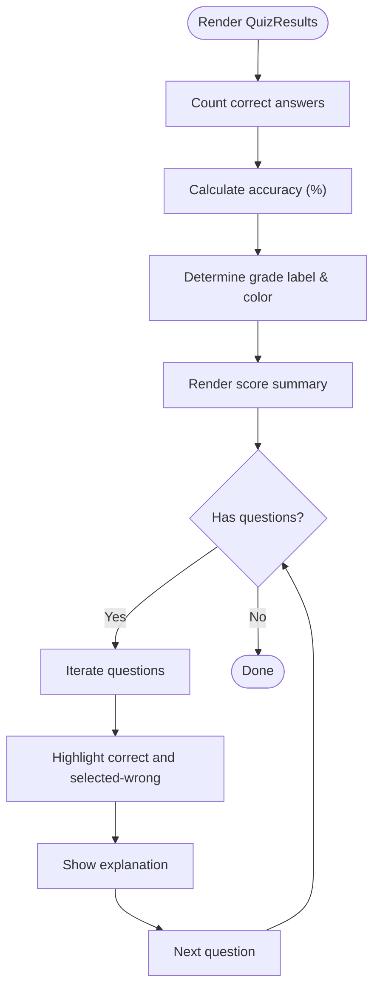
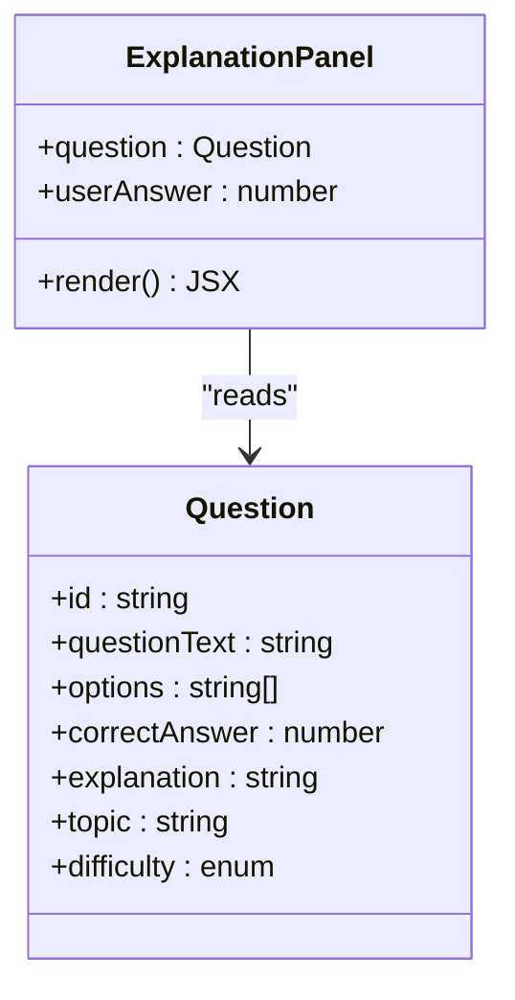
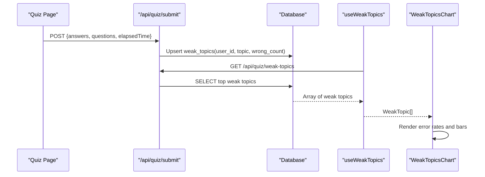
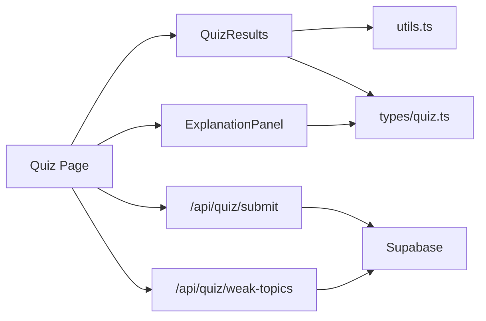

# Quiz Results and Analytics

<cite>
**Referenced Files in This Document**
- [QuizResults.tsx](file://Next-app/src/components/quiz/QuizResults.tsx)
- [ExplanationPanel.tsx](file://Next-app/src/components/quiz/ExplanationPanel.tsx)
- [page.tsx (Quiz Page)](file://Next-app/src/app/(dashboard)/quiz/page.tsx)
- [page.tsx (Results Fallback)](file://Next-app/src/app/(dashboard)/quiz/results/page.tsx)
- [route.ts (Submit Results)](file://Next-app/src/app/api/quiz/submit/route.ts)
- [route.ts (Weak Topics API)](file://Next-app/src/app/api/quiz/weak-topics/route.ts)
- [utils.ts](file://Next-app/src/lib/utils.ts)
- [quiz.ts](file://Next-app/src/types/quiz.ts)
- [user.ts](file://Next-app/src/types/user.ts)
- [WeakTopicsChart.tsx](file://Next-app/src/components/dashboard/WeakTopicsChart.tsx)
- [useWeakTopics.ts](file://Next-app/src/lib/hooks/useWeakTopics.ts)
</cite>

## Table of Contents
1. Introduction
2. Project Structure
3. Core Components
4. Architecture Overview
5. Detailed Component Analysis
6. Dependency Analysis
7. Performance Considerations
8. Troubleshooting Guide
9. Conclusion
10. Appendices

## Introduction
This document explains how quiz results and analytics are displayed and processed in the application. It focuses on:
- The QuizResults component for final scores, correct/incorrect breakdowns, and performance metrics.
- The ExplanationPanel component for detailed answer explanations and learning insights.
- How weak topics are identified and surfaced to guide personalized study recommendations.
- Data flows from quiz completion to persistence and analytics endpoints.
- Visualization techniques used to present performance data and suggestions for extending export capabilities.

## Project Structure
The quiz results flow spans UI components, a client-side page orchestrating state, and server routes that persist results and compute analytics.

**Diagram sources**
- [page.tsx (Quiz Page):18-113](file://Next-app/src/app/(dashboard)/quiz/page.tsx#L18-L113)
- [QuizResults.tsx:17-149](file://Next-app/src/components/quiz/QuizResults.tsx#L17-L149)
- [ExplanationPanel.tsx:10-44](file://Next-app/src/components/quiz/ExplanationPanel.tsx#L10-L44)
- [route.ts (Submit Results):4-113](file://Next-app/src/app/api/quiz/submit/route.ts#L4-L113)
- [route.ts (Weak Topics API):4-33](file://Next-app/src/app/api/quiz/weak-topics/route.ts#L4-L33)

**Section sources**
- [page.tsx (Quiz Page):18-113](file://Next-app/src/app/(dashboard)/quiz/page.tsx#L18-L113)
- [route.ts (Submit Results):4-113](file://Next-app/src/app/api/quiz/submit/route.ts#L4-L113)
- [route.ts (Weak Topics API):4-33](file://Next-app/src/app/api/quiz/weak-topics/route.ts#L4-L33)

## Core Components
- QuizResults: Displays score summary, accuracy, time taken, question review with correct/incorrect indicators, and weak topics list.
- ExplanationPanel: Shows per-question feedback with correct answer highlighting and explanation text.
- WeakTopicAlert: Highlights newly identified weak topics after finishing a quiz.
- Utilities: calculateAccuracy and formatTime support metric computation and display formatting.

Key responsibilities:
- Compute and render final metrics (accuracy, grade).
- Render per-question review with options highlighted as correct or selected-wrong.
- Surface weak topics for targeted improvement.
- Provide immediate learning feedback via explanations.

**Section sources**
- [QuizResults.tsx:17-149](file://Next-app/src/components/quiz/QuizResults.tsx#L17-L149)
- [ExplanationPanel.tsx:10-44](file://Next-app/src/components/quiz/ExplanationPanel.tsx#L10-L44)
- [utils.ts:17-26](file://Next-app/src/lib/utils.ts#L17-L26)

## Architecture Overview
End-to-end flow from answering to analytics:

**Diagram sources**
- [page.tsx (Quiz Page):50-75](file://Next-app/src/app/(dashboard)/quiz/page.tsx#L50-L75)
- [route.ts (Submit Results):15-104](file://Next-app/src/app/api/quiz/submit/route.ts#L15-L104)
- [route.ts (Weak Topics API):4-33](file://Next-app/src/app/api/quiz/weak-topics/route.ts#L4-L33)

## Detailed Component Analysis

### QuizResults Component
Purpose:
- Present final score summary with accuracy percentage, correct count, and elapsed time.
- Grade the performance based on accuracy thresholds.
- Review each question with option highlighting and explanation.
- Display weak topics identified during the session.

Data inputs:
- questions: Question[]
- answers: UserAnswer[]
- elapsedTime: number
- weakTopics: string[]
- onRestart: function

Processing logic:
- Correct count derived from answers.
- Accuracy computed using utility function.
- Grade determined by accuracy ranges.
- Options rendered with visual cues for correct vs selected wrong.

**Diagram sources**
- [QuizResults.tsx:24-35](file://Next-app/src/components/quiz/QuizResults.tsx#L24-L35)
- [QuizResults.tsx:98-145](file://Next-app/src/components/quiz/QuizResults.tsx#L98-L145)
- [utils.ts:23-26](file://Next-app/src/lib/utils.ts#L23-L26)

**Section sources**
- [QuizResults.tsx:17-149](file://Next-app/src/components/quiz/QuizResults.tsx#L17-L149)

### ExplanationPanel Component
Purpose:
- Provide immediate feedback per question after answering.
- Indicate correctness and show the correct option when wrong.
- Display the explanation text for learning reinforcement.

Inputs:
- question: Question
- userAnswer: number

Behavior:
- Compares userAnswer with correctAnswer to determine correctness.
- Renders contextual iconography and messages.
- Always shows explanation text.

**Diagram sources**
- [ExplanationPanel.tsx:10-44](file://Next-app/src/components/quiz/ExplanationPanel.tsx#L10-L44)
- [quiz.ts:1-9](file://Next-app/src/types/quiz.ts#L1-L9)

**Section sources**
- [ExplanationPanel.tsx:10-44](file://Next-app/src/components/quiz/ExplanationPanel.tsx#L10-L44)

### Weak Topic Identification and Alerts
Identification:
- On last question completion, collect topics of incorrect answers into a Set to avoid duplicates.
- Pass the resulting array to WeakTopicAlert and QuizResults.

Persistence:
- Server route aggregates wrong counts per topic and upserts into weak_topics table keyed by user_id and topic.

Retrieval:
- Client hook fetches top weak topics ordered by wrong_count for dashboard visualization.

**Diagram sources**
- [page.tsx (Quiz Page):50-75](file://Next-app/src/app/(dashboard)/quiz/page.tsx#L50-L75)
- [route.ts (Submit Results):79-101](file://Next-app/src/app/api/quiz/submit/route.ts#L79-L101)
- [route.ts (Weak Topics API):4-33](file://Next-app/src/app/api/quiz/weak-topics/route.ts#L4-L33)
- [useWeakTopics.ts:6-18](file://Next-app/src/lib/hooks/useWeakTopics.ts#L6-L18)
- [WeakTopicsChart.tsx:8-52](file://Next-app/src/components/dashboard/WeakTopicsChart.tsx#L8-L52)

**Section sources**
- [page.tsx (Quiz Page):50-75](file://Next-app/src/app/(dashboard)/quiz/page.tsx#L50-L75)
- [route.ts (Submit Results):79-101](file://Next-app/src/app/api/quiz/submit/route.ts#L79-L101)
- [route.ts (Weak Topics API):4-33](file://Next-app/src/app/api/quiz/weak-topics/route.ts#L4-L33)
- [useWeakTopics.ts:6-18](file://Next-app/src/lib/hooks/useWeakTopics.ts#L6-L18)
- [WeakTopicsChart.tsx:8-52](file://Next-app/src/components/dashboard/WeakTopicsChart.tsx#L8-L52)

### Data Models
Core types used across components and APIs:

- Question: id, questionText, options, correctAnswer, explanation, topic, difficulty
- UserAnswer: questionId, selectedAnswer, isCorrect, timeTaken
- SessionResult: sessionId, totalQuestions, correctAnswers, accuracy, timeTaken, weakTopicsIdentified, answers, questions
- WeakTopic: id, userId, topic, wrongCount, totalCount, lastUpdated

These models ensure consistent data flow between UI and server.

**Section sources**
- [quiz.ts:1-47](file://Next-app/src/types/quiz.ts#L1-L47)
- [user.ts:8-15](file://Next-app/src/types/user.ts#L8-L15)

## Dependency Analysis
Coupling and cohesion:
- QuizResults depends on utils for calculations and types for data shapes.
- ExplanationPanel depends only on Question type and UI primitives.
- Quiz Page orchestrates state and triggers API calls; it composes multiple components.
- Server routes depend on Supabase client and database schema.

External dependencies:
- Supabase for authentication and persistence.
- React Query for caching weak topics.

Potential circular dependencies:
- None observed; components are unidirectional consumers of props and hooks.

Integration points:
- /api/quiz/submit persists sessions, questions, answers, and updates weak topics.
- /api/quiz/weak-topics provides aggregated weak topics for dashboards.

**Diagram sources**
- [QuizResults.tsx:1-7](file://Next-app/src/components/quiz/QuizResults.tsx#L1-L7)
- [ExplanationPanel.tsx:1-3](file://Next-app/src/components/quiz/ExplanationPanel.tsx#L1-L3)
- [page.tsx (Quiz Page):18-75](file://Next-app/src/app/(dashboard)/quiz/page.tsx#L18-L75)
- [route.ts (Submit Results):1-113](file://Next-app/src/app/api/quiz/submit/route.ts#L1-L113)
- [route.ts (Weak Topics API):1-33](file://Next-app/src/app/api/quiz/weak-topics/route.ts#L1-L33)

**Section sources**
- [page.tsx (Quiz Page):18-75](file://Next-app/src/app/(dashboard)/quiz/page.tsx#L18-L75)
- [route.ts (Submit Results):1-113](file://Next-app/src/app/api/quiz/submit/route.ts#L1-L113)
- [route.ts (Weak Topics API):1-33](file://Next-app/src/app/api/quiz/weak-topics/route.ts#L1-L33)

## Performance Considerations
- Accuracy calculation is O(n) over answers; acceptable for typical quiz sizes.
- Weak topic aggregation uses Map/Set for deduplication and counting; efficient.
- Fire-and-forget submission avoids blocking UI; consider retry/backoff for reliability.
- Caching weak topics via React Query reduces network overhead.

[No sources needed since this section provides general guidance]

## Troubleshooting Guide
Common issues and mitigations:
- Unauthorized access to APIs: Ensure user is authenticated before calling submit or fetching weak topics.
- Database write failures: Check Supabase credentials and table schemas; errors are logged server-side.
- Missing weak topics: Verify that wrong topics are correctly extracted and upserted; confirm ordering and limits in retrieval.

Relevant code paths:
- Authentication checks and error responses in both server routes.
- Error logging and fallback responses when queries fail.

**Section sources**
- [route.ts (Submit Results):4-13](file://Next-app/src/app/api/quiz/submit/route.ts#L4-L13)
- [route.ts (Submit Results):40-42](file://Next-app/src/app/api/quiz/submit/route.ts#L40-L42)
- [route.ts (Submit Results):105-111](file://Next-app/src/app/api/quiz/submit/route.ts#L105-L111)
- [route.ts (Weak Topics API):4-13](file://Next-app/src/app/api/quiz/weak-topics/route.ts#L4-L13)
- [route.ts (Weak Topics API):22-31](file://Next-app/src/app/api/quiz/weak-topics/route.ts#L22-L31)

## Conclusion
The quiz results and analytics system combines immediate feedback with persistent analytics:
- QuizResults presents clear, actionable summaries and reviews.
- ExplanationPanel reinforces learning per question.
- Weak topic identification drives personalized study recommendations through persisted analytics and dashboard visualizations.
- Server routes ensure reliable storage and retrieval of performance data.

To extend capabilities:
- Add charting libraries for richer visualizations (e.g., bar charts for accuracy trends).
- Implement export features (CSV/PDF) for quiz history and weak topics.
- Enhance recommendation engine by integrating recent accuracy and topic mastery signals.

[No sources needed since this section summarizes without analyzing specific files]

## Appendices

### Score Calculation and Grading
- Accuracy: calculated as percentage of correct answers.
- Grade thresholds: excellent, good, fair, needs improvement based on accuracy ranges.

**Section sources**
- [utils.ts:23-26](file://Next-app/src/lib/utils.ts#L23-L26)
- [QuizResults.tsx:28-35](file://Next-app/src/components/quiz/QuizResults.tsx#L28-L35)

### Data Visualization Techniques
- Weak topics chart: horizontal bars representing relative frequency of wrong answers per topic; includes error rate percentages.
- Inline badges and progress indicators for quick scanning.

**Section sources**
- [WeakTopicsChart.tsx:8-52](file://Next-app/src/components/dashboard/WeakTopicsChart.tsx#L8-L52)

### Export Capabilities
Current implementation does not include built-in export functions. Recommended approaches:
- CSV export: Generate from quiz history and weak topics arrays on the client.
- PDF report: Use a reporting library to render summary, weak topics, and recommendations.
- API endpoint: Provide server-side export endpoints for large datasets.

[No sources needed since this section proposes enhancements not present in current code]