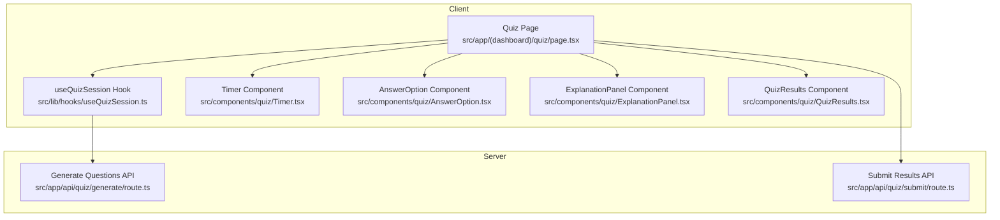
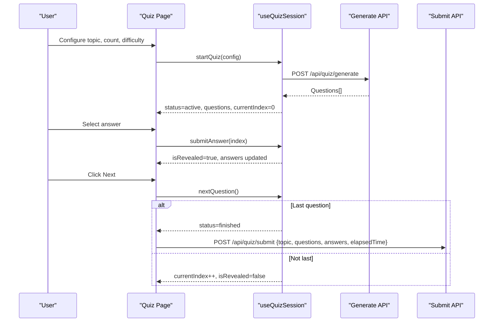
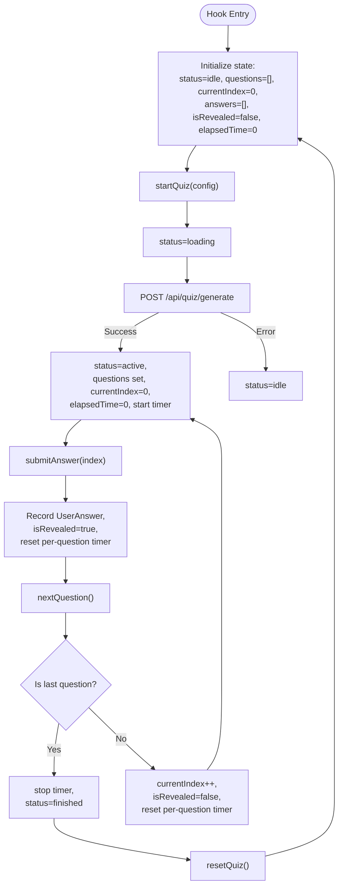
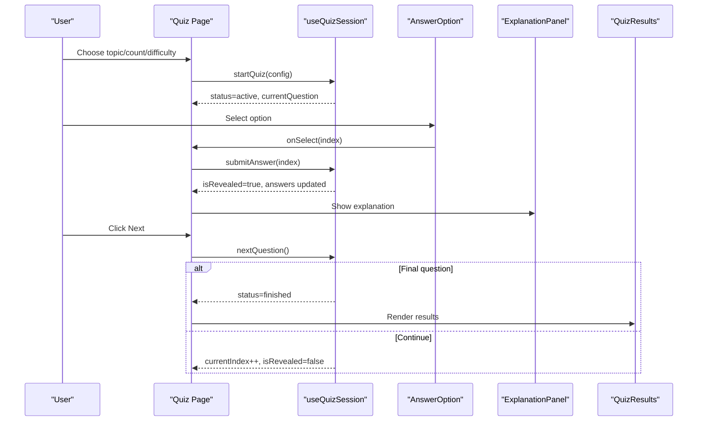
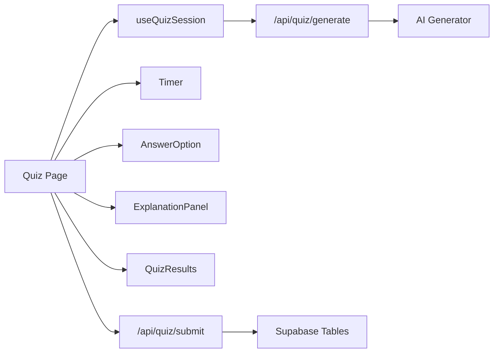

# Quiz Session Management

<cite>
**Referenced Files in This Document**
- [useQuizSession.ts](file://src/lib/hooks/useQuizSession.ts)
- [quiz.ts](file://src/types/quiz.ts)
- [page.tsx](file://src/app/(dashboard)/quiz/page.tsx)
- [Timer.tsx](file://src/components/quiz/Timer.tsx)
- [AnswerOption.tsx](file://src/components/quiz/AnswerOption.tsx)
- [ExplanationPanel.tsx](file://src/components/quiz/ExplanationPanel.tsx)
- [QuizResults.tsx](file://src/components/quiz/QuizResults.tsx)
- [generate route.ts](file://src/app/api/quiz/generate/route.ts)
- [submit route.ts](file://src/app/api/quiz/submit/route.ts)
</cite>

## Table of Contents
1. Introduction
2. Project Structure
3. Core Components
4. Architecture Overview
5. Detailed Component Analysis
6. Dependency Analysis
7. Performance Considerations
8. Troubleshooting Guide
9. Conclusion
10. Appendices

## Introduction
This document explains the quiz session management system centered around the useQuizSession hook. It covers state management across the quiz lifecycle (idle, loading, active, finished), question navigation, answer tracking, and timer functionality. It also documents the QuizSessionState interface, method signatures for startQuiz, submitAnswer, nextQuestion, and resetQuiz, along with configuration patterns, error handling, performance considerations for large question sets, and integration points with UI components and API routes.

## Project Structure
The quiz feature is implemented as a client-side React page that composes several components and uses a custom hook to manage session state. The backend exposes Next.js API routes for generating questions and submitting results.

**Diagram sources**
- [page.tsx:1-185](file://src/app/(dashboard)/quiz/page.tsx#L1-L185)
- [useQuizSession.ts:1-157](file://src/lib/hooks/useQuizSession.ts#L1-L157)
- [Timer.tsx:1-31](file://src/components/quiz/Timer.tsx#L1-L31)
- [AnswerOption.tsx:1-70](file://src/components/quiz/AnswerOption.tsx#L1-L70)
- [ExplanationPanel.tsx:1-44](file://src/components/quiz/ExplanationPanel.tsx#L1-L44)
- [QuizResults.tsx:1-149](file://src/components/quiz/QuizResults.tsx#L1-L149)
- [generate route.ts:1-32](file://src/app/api/quiz/generate/route.ts#L1-L32)
- [submit route.ts:1-113](file://src/app/api/quiz/submit/route.ts#L1-L113)

**Section sources**
- [page.tsx:1-185](file://src/app/(dashboard)/quiz/page.tsx#L1-L185)
- [useQuizSession.ts:1-157](file://src/lib/hooks/useQuizSession.ts#L1-L157)

## Core Components
- useQuizSession hook: Owns quiz lifecycle state, question navigation, answer recording, and timing. Exposes methods to start, answer, navigate, and reset sessions.
- Quiz Page: Orchestrates UI states based on hook status, wires user interactions to hook methods, and calls APIs for generation and submission.
- Timer component: Displays elapsed time during active quiz phases.
- AnswerOption and ExplanationPanel: Render options and post-answer feedback.
- QuizResults: Summarizes performance and supports restart.

Key responsibilities:
- State transitions: idle → loading → active → finished (and back to idle via reset).
- Question navigation: currentIndex increments; last question triggers finish.
- Answer tracking: records selected option, correctness, and per-question time taken.
- Timer: increments elapsedTime while active and not revealed; stops at finish or reset.

**Section sources**
- [useQuizSession.ts:11-18](file://src/lib/hooks/useQuizSession.ts#L11-L18)
- [useQuizSession.ts:20-156](file://src/lib/hooks/useQuizSession.ts#L20-L156)
- [page.tsx:18-185](file://src/app/(dashboard)/quiz/page.tsx#L18-L185)
- [Timer.tsx:1-31](file://src/components/quiz/Timer.tsx#L1-L31)
- [AnswerOption.tsx:1-70](file://src/components/quiz/AnswerOption.tsx#L1-L70)
- [ExplanationPanel.tsx:1-44](file://src/components/quiz/ExplanationPanel.tsx#L1-L44)
- [QuizResults.tsx:1-149](file://src/components/quiz/QuizResults.tsx#L1-L149)

## Architecture Overview
The quiz flow begins with the user configuring a session via QuizSetup. The page calls startQuiz(config), which fetches questions from the generate API, transitions to active, and starts the timer. Users select answers; submitAnswer records timing and correctness and reveals explanations. On nextQuestion, the index advances or the session finishes. Finally, results are submitted to the submit API and displayed.

**Diagram sources**
- [page.tsx:38-75](file://src/app/(dashboard)/quiz/page.tsx#L38-L75)
- [useQuizSession.ts:50-123](file://src/lib/hooks/useQuizSession.ts#L50-L123)
- [generate route.ts:4-23](file://src/app/api/quiz/generate/route.ts#L4-L23)
- [submit route.ts:4-104](file://src/app/api/quiz/submit/route.ts#L4-L104)

## Detailed Component Analysis

### useQuizSession Hook
- State model: QuizSessionState includes status, questions array, currentIndex, answers array, isRevealed flag, and elapsedTime counter.
- Lifecycle:
  - startQuiz(config): Sets status to loading, fetches questions from /api/quiz/generate, then sets status to active with fresh state and starts timer.
  - submitAnswer(selectedAnswer): Computes timeTaken since question start, determines correctness, appends UserAnswer, sets isRevealed=true, resets per-question start time.
  - nextQuestion(): If last question, stops timer and sets status to finished; otherwise increments currentIndex and resets isRevealed and per-question start time.
  - resetQuiz(): Stops timer and clears all state back to idle.
- Derived values: currentQuestion, progress percentage, correctCount exposed for UI.

**Diagram sources**
- [useQuizSession.ts:20-156](file://src/lib/hooks/useQuizSession.ts#L20-L156)
- [generate route.ts:4-23](file://src/app/api/quiz/generate/route.ts#L4-L23)

**Section sources**
- [useQuizSession.ts:11-18](file://src/lib/hooks/useQuizSession.ts#L11-L18)
- [useQuizSession.ts:50-135](file://src/lib/hooks/useQuizSession.ts#L50-L135)

### Quiz Page Integration
- Renders different views based on status: setup (idle), spinner (loading), quiz (active), results (finished).
- Wires user actions:
  - handleStart calls startQuiz with configured parameters.
  - handleSelectAnswer updates local selection and calls submitAnswer when not already revealed.
  - handleNext computes weak topics on final question, submits results to /api/quiz/submit, then calls nextQuestion.
- Uses Timer to show elapsed time only when active and not revealed.

**Diagram sources**
- [page.tsx:38-185](file://src/app/(dashboard)/quiz/page.tsx#L38-L185)
- [AnswerOption.tsx:15-68](file://src/components/quiz/AnswerOption.tsx#L15-L68)
- [ExplanationPanel.tsx:10-43](file://src/components/quiz/ExplanationPanel.tsx#L10-L43)
- [QuizResults.tsx:17-149](file://src/components/quiz/QuizResults.tsx#L17-L149)

**Section sources**
- [page.tsx:18-185](file://src/app/(dashboard)/quiz/page.tsx#L18-L185)
- [AnswerOption.tsx:1-70](file://src/components/quiz/AnswerOption.tsx#L1-L70)
- [ExplanationPanel.tsx:1-44](file://src/components/quiz/ExplanationPanel.tsx#L1-L44)
- [QuizResults.tsx:1-149](file://src/components/quiz/QuizResults.tsx#L1-L149)

### Timer Component
- Maintains its own second counter when running is true.
- Resets to zero when running becomes true again.
- Displays formatted time using a shared utility.

**Section sources**
- [Timer.tsx:1-31](file://src/components/quiz/Timer.tsx#L1-L31)

### Types and Interfaces
- Question: id, questionText, options, correctAnswer (index), explanation, topic, difficulty.
- UserAnswer: questionId, selectedAnswer, isCorrect, timeTaken.
- QuizStatus: "idle" | "loading" | "active" | "reviewing" | "finished".
- QuizSetupConfig: topic, questionCount, difficulty.

These types underpin the hook’s state and the API contracts.

**Section sources**
- [quiz.ts:1-47](file://src/types/quiz.ts#L1-L47)

## Dependency Analysis
- Client-side dependencies:
  - Quiz Page depends on useQuizSession, Timer, AnswerOption, ExplanationPanel, QuizResults.
  - useQuizSession depends on types from quiz.ts and calls generate API.
- Server-side dependencies:
  - Generate API delegates to an AI generator and returns questions.
  - Submit API persists session, questions, answers, and updates weak topics.

**Diagram sources**
- [page.tsx:1-185](file://src/app/(dashboard)/quiz/page.tsx#L1-L185)
- [useQuizSession.ts:1-157](file://src/lib/hooks/useQuizSession.ts#L1-L157)
- [generate route.ts:1-32](file://src/app/api/quiz/generate/route.ts#L1-L32)
- [submit route.ts:1-113](file://src/app/api/quiz/submit/route.ts#L1-L113)

**Section sources**
- [page.tsx:1-185](file://src/app/(dashboard)/quiz/page.tsx#L1-L185)
- [useQuizSession.ts:1-157](file://src/lib/hooks/useQuizSession.ts#L1-L157)
- [generate route.ts:1-32](file://src/app/api/quiz/generate/route.ts#L1-L32)
- [submit route.ts:1-113](file://src/app/api/quiz/submit/route.ts#L1-L113)

## Performance Considerations
- Large question sets:
  - Rendering many options and explanations can be heavy. Consider virtualization or pagination if question counts exceed typical ranges.
  - Debounce or batch any analytics/logging to avoid excessive writes.
- Timer accuracy:
  - The hook increments elapsedTime every second; ensure intervals are cleared on unmount/reset to prevent memory leaks.
- Network requests:
  - Use retry logic and timeouts for /api/quiz/generate to handle transient failures gracefully.
- State updates:
  - Avoid unnecessary re-renders by memoizing derived values (e.g., progress, correctCount) where appropriate.
- Submission reliability:
  - The submit call is fire-and-forget; consider background jobs or retries for robustness in production.

[No sources needed since this section provides general guidance]

## Troubleshooting Guide
- Generation fails:
  - The hook catches errors and resets status to idle. Check network connectivity and server logs for the generate endpoint.
- No questions loaded:
  - Verify the generate API returns a non-empty array and that headers/content type are correct.
- Timer not stopping:
  - Ensure nextQuestion stops the timer on the last question and resetQuiz clears intervals.
- Incorrect answer tracking:
  - Confirm submitAnswer computes timeTaken correctly and marks isCorrect based on the current question’s correctAnswer index.
- Results not persisted:
  - Validate the submit payload matches expected schema and that authentication is valid on the server side.

**Section sources**
- [useQuizSession.ts:50-81](file://src/lib/hooks/useQuizSession.ts#L50-L81)
- [useQuizSession.ts:83-123](file://src/lib/hooks/useQuizSession.ts#L83-L123)
- [generate route.ts:4-31](file://src/app/api/quiz/generate/route.ts#L4-L31)
- [submit route.ts:4-113](file://src/app/api/quiz/submit/route.ts#L4-L113)

## Conclusion
The useQuizSession hook centralizes quiz lifecycle management, providing a clean API for starting sessions, answering questions, navigating between items, and resetting state. Coupled with the Quiz Page and supporting components, it delivers a responsive, interactive quiz experience with clear state transitions and integrated timer behavior. Robust error handling and well-defined types support maintainability and future enhancements such as adaptive difficulty and advanced analytics.

[No sources needed since this section summarizes without analyzing specific files]

## Appendices

### Method Signatures and Behavior
- startQuiz(config: QuizSetupConfig): Initiates quiz generation, transitions to active, initializes state, and starts timer.
- submitAnswer(selectedAnswer: number): Records answer, calculates timeTaken, determines correctness, reveals explanation, and resets per-question timer.
- nextQuestion(): Advances to next question or finishes the quiz on the last item; stops timer upon finish.
- resetQuiz(): Clears all state and stops timer, returning to idle.

**Section sources**
- [useQuizSession.ts:50-135](file://src/lib/hooks/useQuizSession.ts#L50-L135)

### Configuration Examples
- Typical config:
  - topic: one of available topics or "adaptive"
  - questionCount: e.g., 10, 20, 30
  - difficulty: "easy", "medium", "hard", or "adaptive"
- Usage pattern:
  - Collect selections in QuizSetup and pass to onStart, which invokes startQuiz.

**Section sources**
- [page.tsx:38-42](file://src/app/(dashboard)/quiz/page.tsx#L38-L42)
- [quiz.ts:42-46](file://src/types/quiz.ts#L42-L46)

### Error Handling Patterns
- Client-side:
  - Catch fetch errors in startQuiz and revert to idle.
- Server-side:
  - Generate API returns 400 for missing fields and 500 on unexpected errors.
  - Submit API validates auth and persists data; returns success or error responses.

**Section sources**
- [useQuizSession.ts:54-78](file://src/lib/hooks/useQuizSession.ts#L54-L78)
- [generate route.ts:4-31](file://src/app/api/quiz/generate/route.ts#L4-L31)
- [submit route.ts:4-113](file://src/app/api/quiz/submit/route.ts#L4-L113)