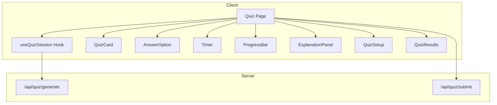
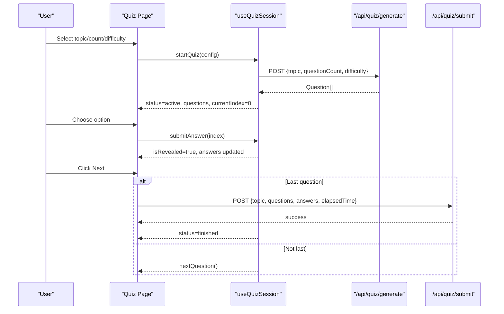
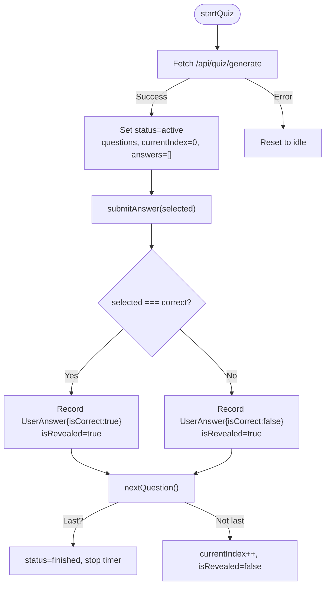
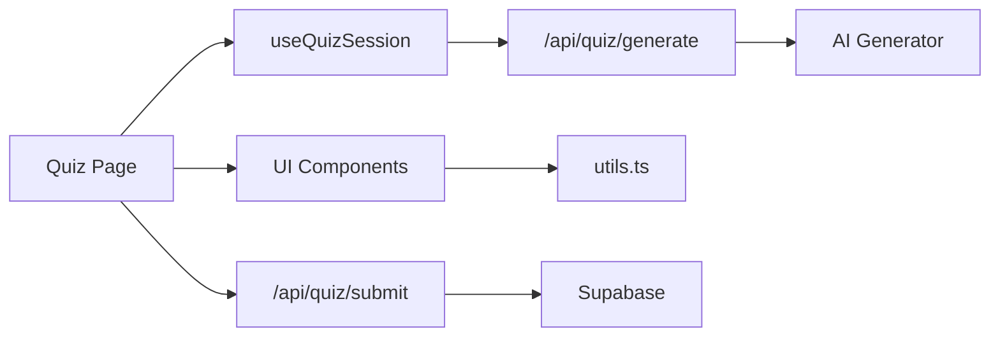

# Quiz System

<cite>
**Referenced Files in This Document**
- [page.tsx](file://Next-app/src/app/(dashboard)/quiz/page.tsx)
- [useQuizSession.ts](file://Next-app/src/lib/hooks/useQuizSession.ts)
- [QuizCard.tsx](file://Next-app/src/components/quiz/QuizCard.tsx)
- [AnswerOption.tsx](file://Next-app/src/components/quiz/AnswerOption.tsx)
- [Timer.tsx](file://Next-app/src/components/quiz/Timer.tsx)
- [ProgressBar.tsx](file://Next-app/src/components/quiz/ProgressBar.tsx)
- [QuizSetup.tsx](file://Next-app/src/components/quiz/QuizSetup.tsx)
- [QuizResults.tsx](file://Next-app/src/components/quiz/QuizResults.tsx)
- [ExplanationPanel.tsx](file://Next-app/src/components/quiz/ExplanationPanel.tsx)
- [quiz.ts](file://Next-app/src/types/quiz.ts)
- [route.ts (generate)](file://Next-app/src/app/api/quiz/generate/route.ts)
- [route.ts (submit)](file://Next-app/src/app/api/quiz/submit/route.ts)
- [constants.ts](file://Next-app/src/lib/constants.ts)
- [utils.ts](file://Next-app/src/lib/utils.ts)
</cite>

## Table of Contents
1. Introduction
2. Project Structure
3. Core Components
4. Architecture Overview
5. Detailed Component Analysis
6. Dependency Analysis
7. Performance Considerations
8. Troubleshooting Guide
9. Conclusion
10. Appendices

## Introduction
This document explains the complete quiz lifecycle in the MedAce-AI application, from question generation to result submission. It covers state management with the useQuizSession hook, UI components for displaying questions and handling interactions, time tracking, progress indication, answer validation, scoring algorithms, real-time updates, and integration with the AI question generator. It also provides guidance on customizing behavior, extending question types, optimizing performance for large sessions, and ensuring mobile responsiveness.

## Project Structure
The quiz feature is implemented as a Next.js client-side page that composes several reusable components and a custom hook:
- Page orchestrates the quiz flow and renders setup, active quiz, and results views based on session status.
- The useQuizSession hook encapsulates quiz state, timers, and transitions between states.
- UI components handle rendering and user interactions: QuizCard, AnswerOption, Timer, ProgressBar, ExplanationPanel, QuizSetup, and QuizResults.
- API routes generate questions via an AI service and persist results to the database.
- Types define shared data contracts for questions, answers, and session metadata.

**Diagram sources**
- [page.tsx:18-184](file://Next-app/src/app/(dashboard)/quiz/page.tsx#L18-L184)
- [useQuizSession.ts:20-156](file://Next-app/src/lib/hooks/useQuizSession.ts#L20-L156)
- [route.ts (generate):4-31](file://Next-app/src/app/api/quiz/generate/route.ts#L4-L31)
- [route.ts (submit):4-112](file://Next-app/src/app/api/quiz/submit/route.ts#L4-L112)

**Section sources**
- [page.tsx:18-184](file://Next-app/src/app/(dashboard)/quiz/page.tsx#L18-L184)
- [useQuizSession.ts:20-156](file://Next-app/src/lib/hooks/useQuizSession.ts#L20-L156)

## Core Components
- useQuizSession: Manages quiz lifecycle states (idle, loading, active, finished), tracks current question index, records answers with correctness and time taken, controls elapsed time, and exposes actions to start, submit, navigate, and reset.
- QuizPage: Renders setup when idle, spinner when loading, results when finished, and the active quiz view otherwise. It wires user interactions to the hook and persists results at completion.
- QuizCard: Displays the current question text with its number.
- AnswerOption: Presents selectable options with visual feedback for selection, correctness, and disabled states.
- Timer: Counts seconds while the quiz is active and not revealed; formats time for display.
- ProgressBar: Shows current question index, total count, and answered status per question.
- ExplanationPanel: Shows immediate feedback and explanation after answering.
- QuizSetup: Collects topic, question count, and difficulty before starting.
- QuizResults: Summarizes score, accuracy, time, weak topics, and allows review or restart.

**Section sources**
- [useQuizSession.ts:20-156](file://Next-app/src/lib/hooks/useQuizSession.ts#L20-L156)
- [page.tsx:18-184](file://Next-app/src/app/(dashboard)/quiz/page.tsx#L18-L184)
- [QuizCard.tsx:9-18](file://Next-app/src/components/quiz/QuizCard.tsx#L9-L18)
- [AnswerOption.tsx:15-68](file://Next-app/src/components/quiz/AnswerOption.tsx#L15-L68)
- [Timer.tsx:12-30](file://Next-app/src/components/quiz/Timer.tsx#L12-L30)
- [ProgressBar.tsx:10-41](file://Next-app/src/components/quiz/ProgressBar.tsx#L10-L41)
- [ExplanationPanel.tsx:10-43](file://Next-app/src/components/quiz/ExplanationPanel.tsx#L10-L43)
- [QuizSetup.tsx:14-81](file://Next-app/src/components/quiz/QuizSetup.tsx#L14-L81)
- [QuizResults.tsx:17-148](file://Next-app/src/components/quiz/QuizResults.tsx#L17-L148)

## Architecture Overview
The quiz system follows a clear separation of concerns:
- Client orchestration: The page coordinates UI and delegates state and timing to the hook.
- Stateful logic: The hook centralizes transitions, answer recording, and timer control.
- Server endpoints: A generate endpoint produces questions using an AI client; a submit endpoint persists results and updates weak topics.
- Data contracts: Shared TypeScript interfaces ensure consistency across client and server payloads.

**Diagram sources**
- [page.tsx:38-75](file://Next-app/src/app/(dashboard)/quiz/page.tsx#L38-L75)
- [useQuizSession.ts:50-123](file://Next-app/src/lib/hooks/useQuizSession.ts#L50-L123)
- [route.ts (generate):4-31](file://Next-app/src/app/api/quiz/generate/route.ts#L4-L31)
- [route.ts (submit):4-112](file://Next-app/src/app/api/quiz/submit/route.ts#L4-L112)

## Detailed Component Analysis

### useQuizSession Hook
Responsibilities:
- Initializes and manages quiz state machine: idle → loading → active → finished.
- Starts/stops a global elapsed timer and per-question timing using refs.
- Generates questions by calling the generate API and sets up the first question.
- Validates answers against the correct option, records UserAnswer with timeTaken, and reveals feedback.
- Advances to the next question or finishes the session when reaching the last question.
- Resets the session to idle for reuse.

Key behaviors:
- Timer precision: Uses setInterval to increment elapsedTime every second; resets per question start.
- Answer validation: Compares selected index with correctAnswer; computes timeTaken from question start timestamp.
- Progress and scoring: Exposes derived values like currentQuestion, progress percentage, and correctCount.

**Diagram sources**
- [useQuizSession.ts:50-123](file://Next-app/src/lib/hooks/useQuizSession.ts#L50-L123)

**Section sources**
- [useQuizSession.ts:20-156](file://Next-app/src/lib/hooks/useQuizSession.ts#L20-L156)

### Quiz Page
Responsibilities:
- Renders different views based on hook status: setup, loading spinner, active quiz, and results.
- Wires user interactions to the hook: selecting answers, navigating, restarting.
- Computes weak topics from incorrect answers and submits results to the server.

Flow highlights:
- On start: clears local selections and calls startQuiz.
- On answer select: prevents interaction if already revealed; calls submitAnswer.
- On next: calculates weak topics on final question and fires a fire-and-forget POST to submit results.

**Section sources**
- [page.tsx:18-184](file://Next-app/src/app/(dashboard)/quiz/page.tsx#L18-L184)

### QuizCard
Displays the current question text with a numbered prefix inside a card container.

**Section sources**
- [QuizCard.tsx:9-18](file://Next-app/src/components/quiz/QuizCard.tsx#L9-L18)

### AnswerOption
Handles option selection and visual states:
- Selected: highlights border/background.
- Revealed: shows correct (green) or incorrect (red) styling.
- Disabled: prevents further interaction once revealed.

**Section sources**
- [AnswerOption.tsx:15-68](file://Next-app/src/components/quiz/AnswerOption.tsx#L15-L68)

### Timer
Counts seconds while running and displays formatted time. Resets when started and cleans up intervals on unmount or stop.

**Section sources**
- [Timer.tsx:12-30](file://Next-app/src/components/quiz/Timer.tsx#L12-L30)

### ProgressBar
Shows current question index vs total and marks answered questions. Highlights the current step and previously answered steps.

**Section sources**
- [ProgressBar.tsx:10-41](file://Next-app/src/components/quiz/ProgressBar.tsx#L10-L41)

### ExplanationPanel
Provides immediate feedback after answering, showing correctness, correct answer if wrong, and explanation text.

**Section sources**
- [ExplanationPanel.tsx:10-43](file://Next-app/src/components/quiz/ExplanationPanel.tsx#L10-L43)

### QuizSetup
Collects configuration:
- Topic selection including adaptive mode.
- Question count from predefined options.
- Difficulty level selection.

Validates inputs and triggers start via callback.

**Section sources**
- [QuizSetup.tsx:14-81](file://Next-app/src/components/quiz/QuizSetup.tsx#L14-L81)
- [constants.ts:31-50](file://Next-app/src/lib/constants.ts#L31-L50)

### QuizResults
Summarizes:
- Accuracy percentage and grade label.
- Correct count and elapsed time.
- Weak topics identified during the session.
- Review list of questions with correct/wrong indicators and explanations.
- Actions to restart or return to dashboard.

**Section sources**
- [QuizResults.tsx:17-148](file://Next-app/src/components/quiz/QuizResults.tsx#L17-L148)
- [utils.ts:17-26](file://Next-app/src/lib/utils.ts#L17-L26)

## Dependency Analysis
- Client dependencies:
  - page.tsx depends on useQuizSession, all UI components, and types.
  - useQuizSession depends on types and calls /api/quiz/generate and /api/quiz/submit.
  - UI components depend on shared utilities (formatTime, calculateAccuracy, cn).
- Server dependencies:
  - Generate route depends on an AI client to produce questions.
  - Submit route depends on Supabase client to persist sessions, questions, answers, and update weak topics.

**Diagram sources**
- [page.tsx:18-184](file://Next-app/src/app/(dashboard)/quiz/page.tsx#L18-L184)
- [useQuizSession.ts:50-123](file://Next-app/src/lib/hooks/useQuizSession.ts#L50-L123)
- [route.ts (generate):4-31](file://Next-app/src/app/api/quiz/generate/route.ts#L4-L31)
- [route.ts (submit):4-112](file://Next-app/src/app/api/quiz/submit/route.ts#L4-L112)
- [utils.ts:17-26](file://Next-app/src/lib/utils.ts#L17-L26)

**Section sources**
- [page.tsx:18-184](file://Next-app/src/app/(dashboard)/quiz/page.tsx#L18-L184)
- [useQuizSession.ts:50-123](file://Next-app/src/lib/hooks/useQuizSession.ts#L50-L123)
- [route.ts (generate):4-31](file://Next-app/src/app/api/quiz/generate/route.ts#L4-L31)
- [route.ts (submit):4-112](file://Next-app/src/app/api/quiz/submit/route.ts#L4-L112)
- [utils.ts:17-26](file://Next-app/src/lib/utils.ts#L17-L26)

## Performance Considerations
- Large quiz sessions:
  - Avoid re-renders by memoizing expensive computations in components where applicable.
  - Batch DOM updates: The hook updates state minimally per action; keep lists stable and avoid unnecessary object allocations.
  - Debounce or throttle heavy operations if adding analytics or logging.
- Network efficiency:
  - Use error boundaries around fetch calls to prevent UI crashes.
  - Consider caching generated questions locally for short periods to reduce redundant requests.
- Rendering optimization:
  - Keep component trees shallow; pass only necessary props.
  - Use CSS classes efficiently; avoid inline styles for repeated elements.
- Mobile responsiveness:
  - Ensure touch targets are large enough (AnswerOption padding and spacing).
  - Use responsive layouts and readable font sizes; consider stacking options vertically on small screens.
  - Test timer visibility and progress bar readability on narrow viewports.

[No sources needed since this section provides general guidance]

## Troubleshooting Guide
Common issues and resolutions:
- Quiz does not start:
  - Verify /api/quiz/generate returns valid JSON array of questions. Check network tab for errors.
  - Ensure required fields (topic, questionCount) are provided in the request body.
- Answers not recorded:
  - Confirm submitAnswer is called and isRevealed becomes true.
  - Check that currentQuestion exists and has correctAnswer defined.
- Timer not updating:
  - Ensure running prop is true and interval is created/cleared properly.
  - Verify no unhandled exceptions in useEffect cleanup.
- Results not persisted:
  - Check authentication state; submit route requires a logged-in user.
  - Inspect Supabase responses for insert/upsert errors.
- Incorrect weak topics:
  - Validate that topic field is present on each question and used consistently when computing weak topics.

**Section sources**
- [route.ts (generate):4-31](file://Next-app/src/app/api/quiz/generate/route.ts#L4-L31)
- [route.ts (submit):4-112](file://Next-app/src/app/api/quiz/submit/route.ts#L4-L112)
- [useQuizSession.ts:50-123](file://Next-app/src/lib/hooks/useQuizSession.ts#L50-L123)
- [Timer.tsx:12-30](file://Next-app/src/components/quiz/Timer.tsx#L12-L30)

## Conclusion
The quiz system provides a robust, modular experience with clear separation between UI, state management, and server logic. The useQuizSession hook centralizes lifecycle management, while components focus on presentation and interaction. Integration with an AI generator enables dynamic content creation, and the submit endpoint ensures persistent tracking of performance and weak areas. With careful attention to performance and mobile UX, the system scales well for larger sessions and diverse user needs.

[No sources needed since this section summarizes without analyzing specific files]

## Appendices

### Data Models
- Question: Contains id, questionText, options, correctAnswer index, explanation, topic, and difficulty.
- UserAnswer: Records questionId, selectedAnswer, isCorrect, and timeTaken.
- QuizSession: Tracks sessionId, userId, topic, questionCount, score, accuracy, timestamps.
- SessionResult: Aggregates totalQuestions, correctAnswers, accuracy, timeTaken, weakTopicsIdentified, answers, and questions.

**Section sources**
- [quiz.ts:1-47](file://Next-app/src/types/quiz.ts#L1-L47)

### Customization Examples
- Customize quiz behavior:
  - Adjust question counts and difficulty levels via constants to tailor session length and challenge.
  - Modify startQuiz config to include additional parameters (e.g., tags, source filters).
- Extend question types:
  - Expand the Question interface to support new fields (e.g., image URLs, multi-select).
  - Update AnswerOption and ExplanationPanel to render new content types.
- Integrate with AI generator:
  - Enhance prompt engineering in the AI client to improve question quality.
  - Add retry logic and rate limiting for robust generation under load.

**Section sources**
- [constants.ts:31-50](file://Next-app/src/lib/constants.ts#L31-L50)
- [quiz.ts:1-47](file://Next-app/src/types/quiz.ts#L1-L47)
- [route.ts (generate):4-31](file://Next-app/src/app/api/quiz/generate/route.ts#L4-L31)