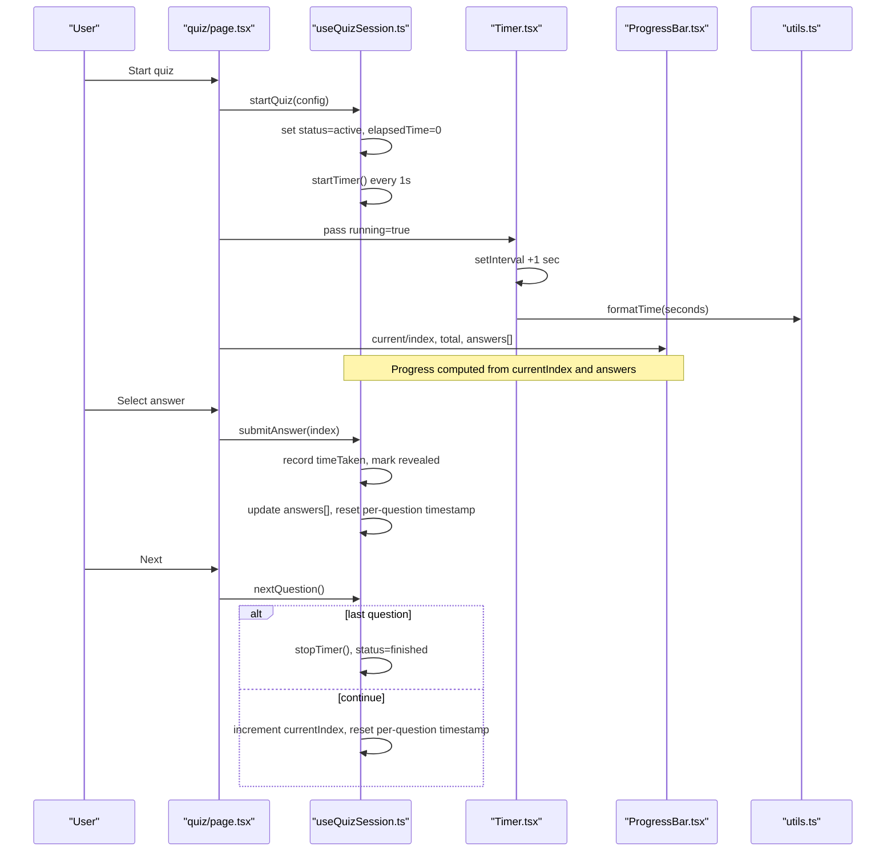
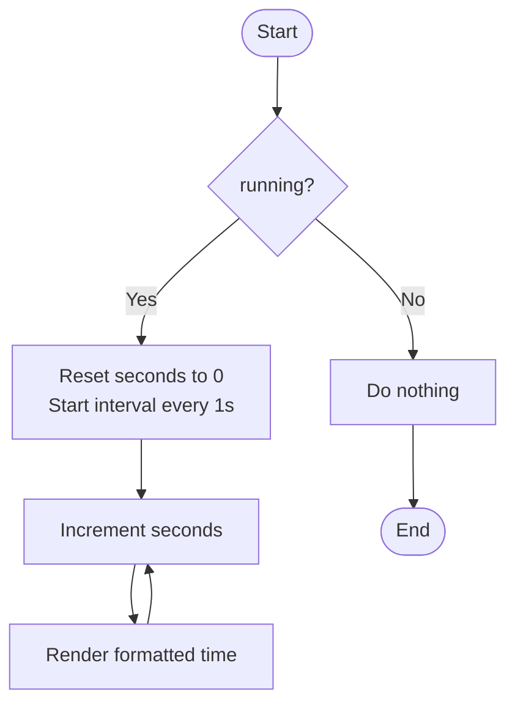
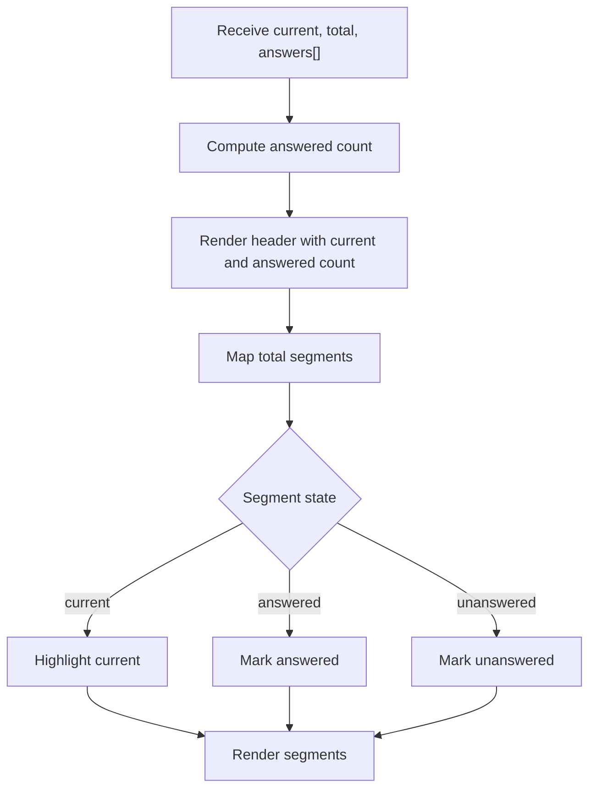
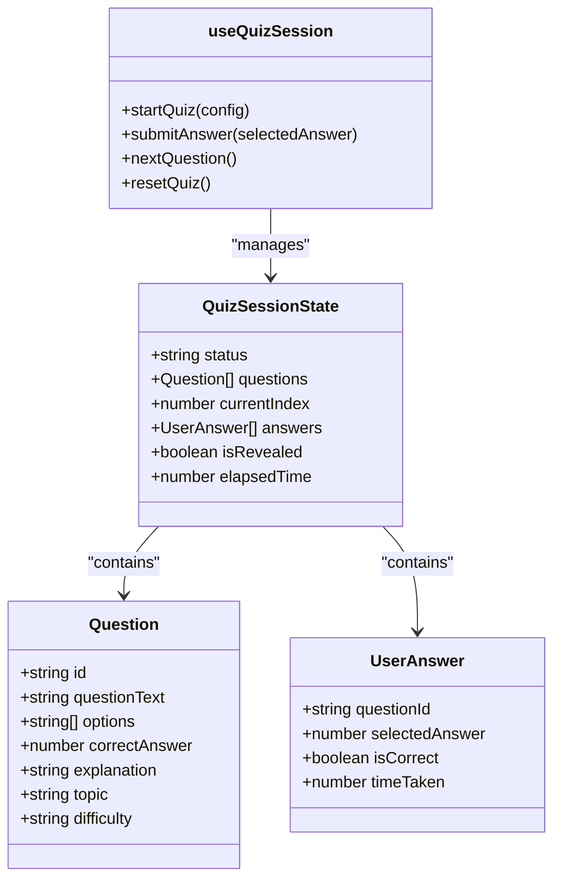
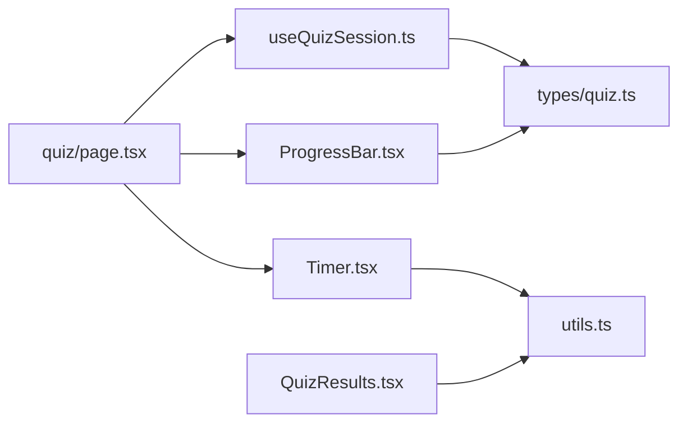

# Timer and Progress Tracking

<cite>
**Referenced Files in This Document**
- [Timer.tsx](file://Next-app/src/components/quiz/Timer.tsx)
- [ProgressBar.tsx](file://Next-app/src/components/quiz/ProgressBar.tsx)
- [Progress.tsx](file://Next-app/src/components/ui/Progress.tsx)
- [useQuizSession.ts](file://Next-app/src/lib/hooks/useQuizSession.ts)
- [page.tsx](file://Next-app/src/app/(dashboard)/quiz/page.tsx)
- [utils.ts](file://Next-app/src/lib/utils.ts)
- [quiz.ts](file://Next-app/src/types/quiz.ts)
- [QuizResults.tsx](file://Next-app/src/components/quiz/QuizResults.tsx)
</cite>

## Table of Contents
1. Introduction
2. Project Structure
3. Core Components
4. Architecture Overview
5. Detailed Component Analysis
6. Dependency Analysis
7. Performance Considerations
8. Troubleshooting Guide
9. Conclusion
10. Appendices

## Introduction
This document explains the timer and progress tracking functionality used during quiz sessions. It covers:
- The Timer component for tracking elapsed time per question and total quiz duration
- The ProgressBar component for visual progress indication (completion percentage and current question position)
- How these components integrate with the quiz session state
- Examples for customizing formats, implementing time warnings, creating animated progress bars, and integrating with session state
- Performance optimization strategies for real-time updates
- Accessibility considerations

## Project Structure
The timer and progress features are implemented across a few focused files:
- Timer displays elapsed seconds using a client-side interval and a formatting utility
- QuizProgressBar shows per-question status and current position
- A generic Progress bar provides an accessible, animated, color-coded progress indicator
- useQuizSession manages quiz lifecycle, timing, and progress calculations
- The quiz page composes these pieces to render the active quiz UI
- Utilities provide time formatting and accuracy calculation
- Types define data structures for questions, answers, and session results

```mermaid
graph TB
subgraph "Quiz Page"
QPage["quiz/page.tsx"]
end
subgraph "Components"
T["components/quiz/Timer.tsx"]
PBar["components/quiz/ProgressBar.tsx"]
Prog["components/ui/Progress.tsx"]
Results["components/quiz/QuizResults.tsx"]
end
subgraph "Hooks & Utils"
Hook["lib/hooks/useQuizSession.ts"]
Util["lib/utils.ts"]
end
subgraph "Types"
Types["types/quiz.ts"]
end
QPage --> T
QPage --> PBar
QPage --> Hook
Hook --> Util
Results --> Util
T --> Util
PBar --> Types
Prog --> Types
```

**Diagram sources**
- [page.tsx:1-185](file://Next-app/src/app/(dashboard)/quiz/page.tsx#L1-L185)
- [Timer.tsx:1-31](file://Next-app/src/components/quiz/Timer.tsx#L1-L31)
- [ProgressBar.tsx:1-42](file://Next-app/src/components/quiz/ProgressBar.tsx#L1-L42)
- [Progress.tsx:1-51](file://Next-app/src/components/ui/Progress.tsx#L1-L51)
- [useQuizSession.ts:1-157](file://Next-app/src/lib/hooks/useQuizSession.ts#L1-L157)
- [utils.ts:1-27](file://Next-app/src/lib/utils.ts#L1-L27)
- [quiz.ts:1-47](file://Next-app/src/types/quiz.ts#L1-L47)
- [QuizResults.tsx:1-149](file://Next-app/src/components/quiz/QuizResults.tsx#L1-L149)

**Section sources**
- [page.tsx:1-185](file://Next-app/src/app/(dashboard)/quiz/page.tsx#L1-L185)
- [Timer.tsx:1-31](file://Next-app/src/components/quiz/Timer.tsx#L1-L31)
- [ProgressBar.tsx:1-42](file://Next-app/src/components/quiz/ProgressBar.tsx#L1-L42)
- [Progress.tsx:1-51](file://Next-app/src/components/ui/Progress.tsx#L1-L51)
- [useQuizSession.ts:1-157](file://Next-app/src/lib/hooks/useQuizSession.ts#L1-L157)
- [utils.ts:1-27](file://Next-app/src/lib/utils.ts#L1-L27)
- [quiz.ts:1-47](file://Next-app/src/types/quiz.ts#L1-L47)
- [QuizResults.tsx:1-149](file://Next-app/src/components/quiz/QuizResults.tsx#L1-L149)

## Core Components
- Timer: A lightweight client component that increments seconds while the quiz is active and not in review mode, then renders formatted time.
- QuizProgressBar: Renders per-question indicators showing current question and answered count.
- Progress: A reusable, accessible progress bar with optional label and color variants.
- useQuizSession: Manages quiz lifecycle, tracks elapsed time, computes progress, and records per-question time taken.

Key responsibilities:
- Timer focuses on display; it does not manage quiz state beyond a running flag.
- useQuizSession owns the global timer and per-question timers via timestamps.
- QuizProgressBar reflects both current index and answer completion.
- Progress offers a general-purpose, animated, accessible bar suitable for other contexts.

**Section sources**
- [Timer.tsx:1-31](file://Next-app/src/components/quiz/Timer.tsx#L1-L31)
- [ProgressBar.tsx:1-42](file://Next-app/src/components/quiz/ProgressBar.tsx#L1-L42)
- [Progress.tsx:1-51](file://Next-app/src/components/ui/Progress.tsx#L1-L51)
- [useQuizSession.ts:1-157](file://Next-app/src/lib/hooks/useQuizSession.ts#L1-L157)

## Architecture Overview
The quiz flow integrates timer and progress as follows:
- The quiz page initializes the session and renders Timer and QuizProgressBar based on session state.
- useQuizSession starts a global timer when the quiz becomes active and stops it when finished or reset.
- Per-question time is captured by recording timestamps before and after each answer submission.
- Progress is computed from current index and whether the current question has been answered.
- Results screen displays total elapsed time and per-question details.



**Diagram sources**
- [page.tsx:18-185](file://Next-app/src/app/(dashboard)/quiz/page.tsx#L18-L185)
- [useQuizSession.ts:33-123](file://Next-app/src/lib/hooks/useQuizSession.ts#L33-L123)
- [Timer.tsx:12-29](file://Next-app/src/components/quiz/Timer.tsx#L12-L29)
- [ProgressBar.tsx:10-40](file://Next-app/src/components/quiz/ProgressBar.tsx#L10-L40)
- [utils.ts:17-21](file://Next-app/src/lib/utils.ts#L17-L21)

## Detailed Component Analysis

### Timer Component
Purpose:
- Display elapsed time while the quiz is active and not in review mode.
- Reset internal counter when started and clear interval on unmount or stop.

Behavior:
- Accepts a running boolean prop to control interval lifecycle.
- Uses a local second counter incremented every second.
- Formats seconds into minutes:seconds using a shared utility.

Integration points:
- The quiz page passes running based on session status and review state.
- Formatting relies on a utility function for consistent output.

Customization examples:
- Change format: Replace the formatter with one that includes hours or milliseconds.
- Add warning: Integrate a callback to notify when nearing a time limit.
- Countdown mode: Instead of incrementing, decrement from a configured limit and stop at zero.

Performance notes:
- Interval runs only when running is true.
- Avoid heavy work inside the interval; keep updates minimal.

Accessibility notes:
- Ensure any added dynamic text is announced appropriately if needed.

**Section sources**
- [Timer.tsx:1-31](file://Next-app/src/components/quiz/Timer.tsx#L1-L31)
- [page.tsx:124-130](file://Next-app/src/app/(dashboard)/quiz/page.tsx#L124-L130)
- [utils.ts:17-21](file://Next-app/src/lib/utils.ts#L17-L21)

#### Timer Flowchart


**Diagram sources**
- [Timer.tsx:12-29](file://Next-app/src/components/quiz/Timer.tsx#L12-L29)

### QuizProgressBar Component
Purpose:
- Show current question number and how many answers have been provided.
- Visualize per-question status with small segments: current, answered, unanswered.

Inputs:
- current: zero-based index of the current question
- total: total number of questions
- answers: boolean array indicating which questions have been answered

Behavior:
- Renders a header with current question and answered count.
- Maps over total to create segment blocks with distinct styles for current vs answered vs unanswered.

Integration points:
- The quiz page constructs a boolean array aligned with the question list length.

Customization examples:
- Add animations: Use CSS transitions to animate segment color changes.
- Indicate wrong answers: Extend the model to include correctness and style accordingly.
- Compact mode: Reduce spacing or hide labels for smaller screens.

Accessibility notes:
- Provide descriptive labels for screen readers if needed (e.g., aria-label).

**Section sources**
- [ProgressBar.tsx:1-42](file://Next-app/src/components/quiz/ProgressBar.tsx#L1-L42)
- [page.tsx:118-137](file://Next-app/src/app/(dashboard)/quiz/page.tsx#L118-L137)

#### Progress Visualization Flow


**Diagram sources**
- [ProgressBar.tsx:10-40](file://Next-app/src/components/quiz/ProgressBar.tsx#L10-L40)

### Generic Progress Component
Purpose:
- Provide an accessible, animated progress bar with optional label and color variants.

Features:
- Calculates percentage from value and max.
- Applies Tailwind classes for smooth transitions.
- Includes ARIA attributes for assistive technologies.

Usage:
- Can be used anywhere a numeric progress is needed (e.g., overall quiz completion).

Customization examples:
- Animate width changes with CSS transitions already applied.
- Toggle label visibility for different layouts.
- Choose colors to reflect success, warning, or error states.

Accessibility notes:
- Already includes role="progressbar" and aria-* attributes.

**Section sources**
- [Progress.tsx:1-51](file://Next-app/src/components/ui/Progress.tsx#L1-L51)

### useQuizSession Hook
Purpose:
- Manage quiz lifecycle, track elapsed time, compute progress, and record per-question metrics.

Key behaviors:
- startQuiz: fetches questions, sets active state, resets counters, and starts a global timer.
- submitAnswer: calculates time taken for the current question, records correctness, reveals explanation, and resets per-question timestamp.
- nextQuestion: advances index, stops timer on last question, and resets per-question timestamp.
- resetQuiz: clears all state and stops timer.
- progress: computed from currentIndex and whether the current question has been answered.

Data tracked:
- elapsedTime: total seconds since quiz start
- answers: array of per-question responses including timeTaken
- currentIndex: current question index
- isRevealed: whether the current answer is shown

Integration points:
- The quiz page consumes this hook to drive rendering and actions.
- Results screen uses elapsedTime and answers to show final stats.

Customization examples:
- Time limits: Add a countdown and enforce submission when time expires.
- Pause/resume: Pause the timer when explanations are revealed.
- Export metrics: Include per-question timeTaken in API payloads.

Performance notes:
- Timer increments once per second; avoid heavy computations in the interval.
- Use refs for timestamps to prevent unnecessary re-renders.

**Section sources**
- [useQuizSession.ts:1-157](file://Next-app/src/lib/hooks/useQuizSession.ts#L1-L157)
- [page.tsx:18-75](file://Next-app/src/app/(dashboard)/quiz/page.tsx#L18-L75)
- [QuizResults.tsx:17-66](file://Next-app/src/components/quiz/QuizResults.tsx#L17-L66)

#### Session State Class Diagram


**Diagram sources**
- [useQuizSession.ts:11-18](file://Next-app/src/lib/hooks/useQuizSession.ts#L11-L18)
- [quiz.ts:1-47](file://Next-app/src/types/quiz.ts#L1-L47)

## Dependency Analysis
- Timer depends on utils.formatTime and a client-side interval.
- QuizProgressBar depends on Tailwind utilities and receives derived arrays from the page.
- useQuizSession depends on types and triggers API calls to generate questions.
- The quiz page composes Timer, ProgressBar, and the hook to render the active quiz.
- Results depend on utils.formatTime and calculateAccuracy.



**Diagram sources**
- [Timer.tsx:1-31](file://Next-app/src/components/quiz/Timer.tsx#L1-L31)
- [page.tsx:1-185](file://Next-app/src/app/(dashboard)/quiz/page.tsx#L1-L185)
- [useQuizSession.ts:1-157](file://Next-app/src/lib/hooks/useQuizSession.ts#L1-L157)
- [ProgressBar.tsx:1-42](file://Next-app/src/components/quiz/ProgressBar.tsx#L1-L42)
- [utils.ts:1-27](file://Next-app/src/lib/utils.ts#L1-L27)
- [quiz.ts:1-47](file://Next-app/src/types/quiz.ts#L1-L47)
- [QuizResults.tsx:1-149](file://Next-app/src/components/quiz/QuizResults.tsx#L1-L149)

**Section sources**
- [Timer.tsx:1-31](file://Next-app/src/components/quiz/Timer.tsx#L1-L31)
- [ProgressBar.tsx:1-42](file://Next-app/src/components/quiz/ProgressBar.tsx#L1-L42)
- [useQuizSession.ts:1-157](file://Next-app/src/lib/hooks/useQuizSession.ts#L1-L157)
- [page.tsx:1-185](file://Next-app/src/app/(dashboard)/quiz/page.tsx#L1-L185)
- [utils.ts:1-27](file://Next-app/src/lib/utils.ts#L1-L27)
- [quiz.ts:1-47](file://Next-app/src/types/quiz.ts#L1-L47)
- [QuizResults.tsx:1-149](file://Next-app/src/components/quiz/QuizResults.tsx#L1-L149)

## Performance Considerations
- Minimize re-renders:
  - Keep interval logic simple; avoid heavy computations inside setInterval.
  - Use refs for timestamps to prevent unnecessary state updates.
- Throttle updates:
  - For high-frequency UI updates, consider requestAnimationFrame or throttling libraries if needed.
- Efficient progress computation:
  - Compute progress from stable values (currentIndex, answers length) rather than recalculating complex expressions frequently.
- Memory management:
  - Always clear intervals on cleanup or when stopping the timer to prevent leaks.
- Network efficiency:
  - Debounce or batch API calls where appropriate; the current implementation uses fire-and-forget for result submission, which avoids blocking UI.

[No sources needed since this section provides general guidance]

## Troubleshooting Guide
Common issues and resolutions:
- Timer not updating:
  - Ensure the running prop is true and the interval is created.
  - Verify that the component remains mounted and not unmounted prematurely.
- Incorrect per-question time:
  - Confirm that timestamps are recorded before and after answer submission.
  - Check that the per-question timestamp resets on next question.
- Progress not reflecting answers:
  - Ensure the boolean array aligns with the total number of questions and marks answered indices correctly.
- Accessibility concerns:
  - Verify ARIA attributes on progress elements and ensure dynamic content is announced if necessary.

**Section sources**
- [Timer.tsx:12-29](file://Next-app/src/components/quiz/Timer.tsx#L12-L29)
- [useQuizSession.ts:83-123](file://Next-app/src/lib/hooks/useQuizSession.ts#L83-L123)
- [ProgressBar.tsx:10-40](file://Next-app/src/components/quiz/ProgressBar.tsx#L10-L40)
- [Progress.tsx:28-47](file://Next-app/src/components/ui/Progress.tsx#L28-L47)

## Conclusion
The timer and progress tracking system combines a lightweight Timer component, a per-question ProgressBar, and a robust useQuizSession hook to deliver accurate timing and clear progress visualization. The design separates concerns effectively: Timer handles display, the hook manages state and timing, and the page orchestrates user interactions. With minor enhancements, you can add countdown modes, time warnings, animated progress bars, and deeper integration with session state while maintaining performance and accessibility.

[No sources needed since this section summarizes without analyzing specific files]

## Appendices

### Customization Examples

- Customize timer format:
  - Replace the formatter with one that includes hours or milliseconds.
  - Reference: [utils.ts:17-21](file://Next-app/src/lib/utils.ts#L17-L21)

- Implement time warnings:
  - Add a threshold check in the timer or hook to trigger warnings when approaching a limit.
  - Reference: [useQuizSession.ts:33-48](file://Next-app/src/lib/hooks/useQuizSession.ts#L33-L48)

- Create animated progress bars:
  - Use the generic Progress component with transitions and optional labels.
  - Reference: [Progress.tsx:28-47](file://Next-app/src/components/ui/Progress.tsx#L28-L47)

- Integrate with quiz session state:
  - Pass running flags and progress data from the hook to components.
  - Reference: [page.tsx:124-137](file://Next-app/src/app/(dashboard)/quiz/page.tsx#L124-L137), [useQuizSession.ts:137-155](file://Next-app/src/lib/hooks/useQuizSession.ts#L137-L155)

- Enforce time limits:
  - Add a countdown timer in the hook and auto-submit or transition to results when time expires.
  - Reference: [useQuizSession.ts:50-81](file://Next-app/src/lib/hooks/useQuizSession.ts#L50-L81)

- Track per-question time:
  - Record timestamps before and after answering to compute timeTaken.
  - Reference: [useQuizSession.ts:83-107](file://Next-app/src/lib/hooks/useQuizSession.ts#L83-L107)

- Display total elapsed time in results:
  - Use the elapsedTime from the hook to show total time in results.
  - Reference: [QuizResults.tsx:59-66](file://Next-app/src/components/quiz/QuizResults.tsx#L59-L66)

**Section sources**
- [utils.ts:17-21](file://Next-app/src/lib/utils.ts#L17-L21)
- [useQuizSession.ts:33-107](file://Next-app/src/lib/hooks/useQuizSession.ts#L33-L107)
- [Progress.tsx:28-47](file://Next-app/src/components/ui/Progress.tsx#L28-L47)
- [page.tsx:124-137](file://Next-app/src/app/(dashboard)/quiz/page.tsx#L124-L137)
- [QuizResults.tsx:59-66](file://Next-app/src/components/quiz/QuizResults.tsx#L59-L66)