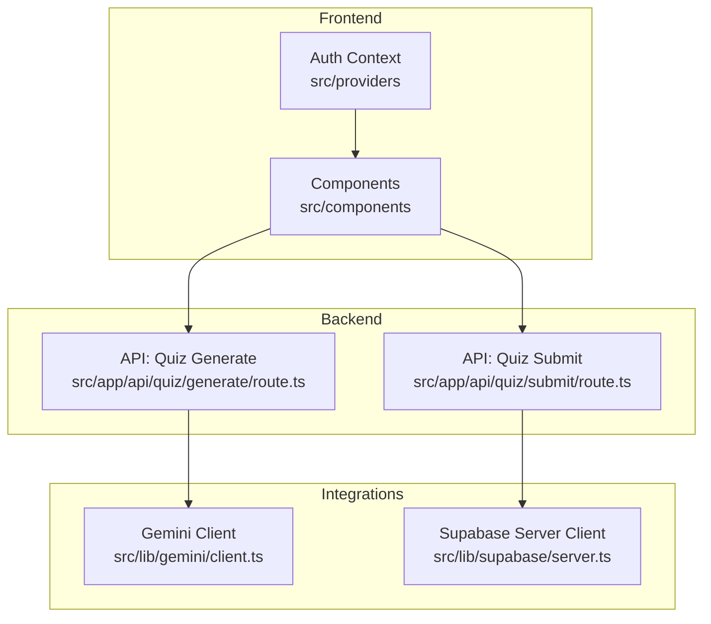
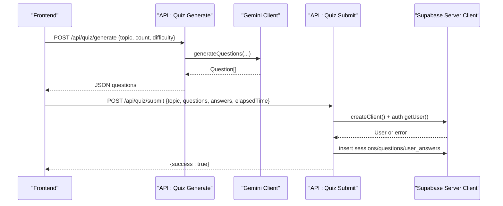
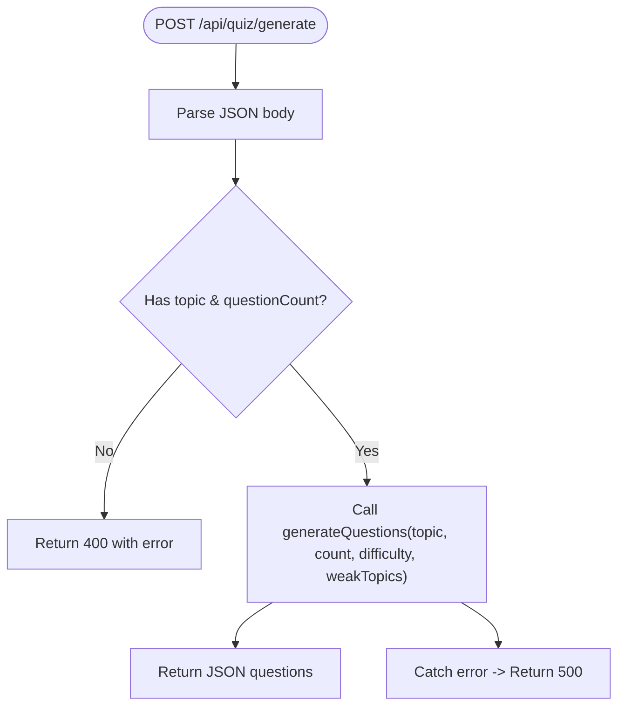
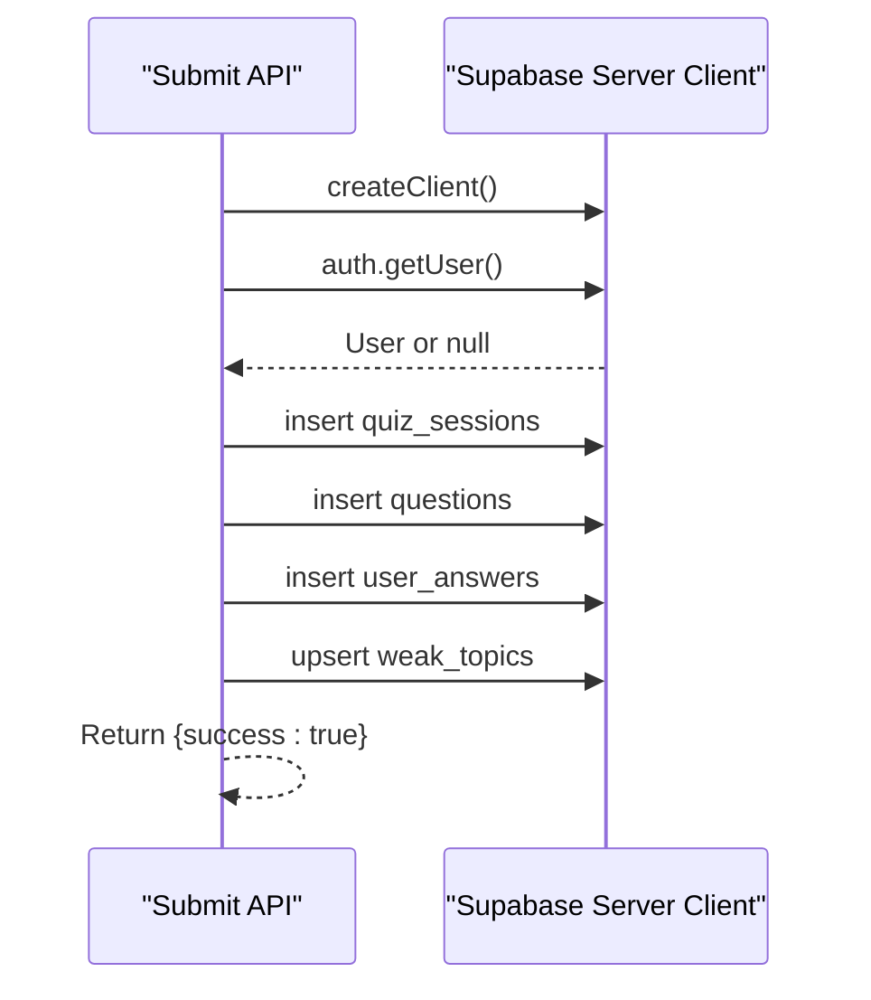
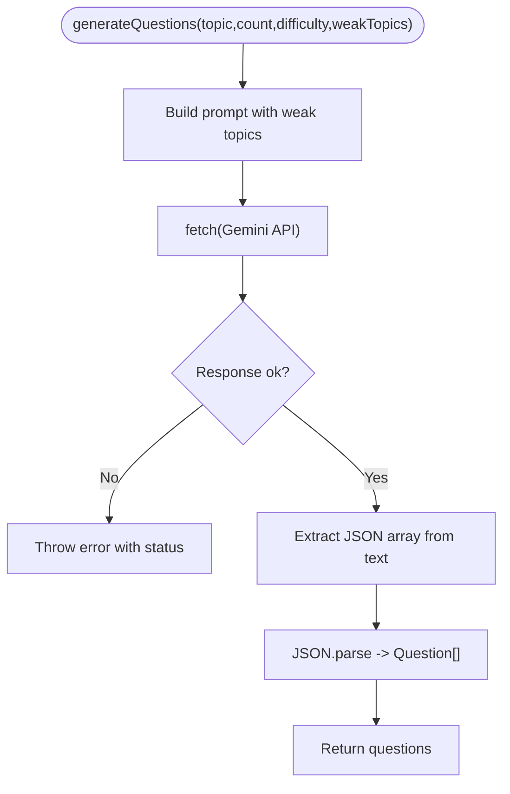
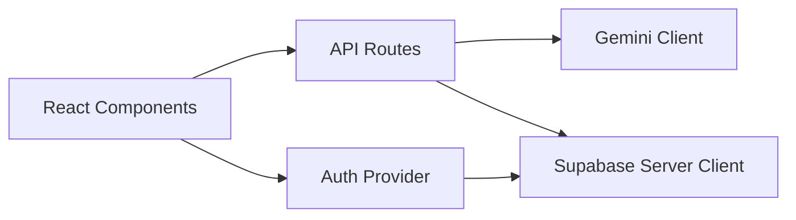

# Testing Strategy

<cite>
**Referenced Files in This Document**
- [package.json](file://Next-app/package.json)
- [eslint.config.mjs](file://Next-app/eslint.config.mjs)
- [route.ts (quiz generate)](file://Next-app/src/app/api/quiz/generate/route.ts)
- [route.ts (quiz submit)](file://Next-app/src/app/api/quiz/submit/route.ts)
- [client.ts (Gemini client)](file://Next-app/src/lib/gemini/client.ts)
- [server.ts (Supabase server client)](file://Next-app/src/lib/supabase/server.ts)
- [QuizCard.tsx](file://Next-app/src/components/quiz/QuizCard.tsx)
- [AuthProvider.tsx](file://Next-app/src/providers/AuthProvider.tsx)
- [quiz.ts (types)](file://Next-app/src/types/quiz.ts)
</cite>

## Table of Contents
1. Introduction
2. Project Structure
3. Core Components
4. Architecture Overview
5. Detailed Component Analysis
6. Dependency Analysis
7. Performance Considerations
8. Troubleshooting Guide
9. Conclusion

## Introduction
This document defines the testing strategy for MedAce-AI, covering unit tests for components and utilities, integration tests for API routes, and end-to-end tests for user workflows. It outlines recommended tools, test organization, mocking strategies for external services (Supabase and Gemini API), and continuous integration setup. It also includes examples for quiz functionality, authentication flows, and AI integration, along with code quality tooling and debugging guidance.

## Project Structure
The application is a Next.js app with:
- API routes under src/app/api for quiz generation and submission
- React components under src/components for UI logic
- Providers for auth state under src/providers
- External integrations via lib/gemini and lib/supabase
- Shared types under src/types

**Diagram sources**
- [route.ts (quiz generate):1-32](file://Next-app/src/app/api/quiz/generate/route.ts#L1-L32)
- [route.ts (quiz submit):1-113](file://Next-app/src/app/api/quiz/submit/route.ts#L1-L113)
- [client.ts (Gemini client):1-135](file://Next-app/src/lib/gemini/client.ts#L1-L135)
- [server.ts (Supabase server client):1-31](file://Next-app/src/lib/supabase/server.ts#L1-L31)
- [AuthProvider.tsx:1-79](file://Next-app/src/providers/AuthProvider.tsx#L1-L79)

**Section sources**
- [package.json:1-38](file://Next-app/package.json#L1-L38)

## Core Components
Key areas to test:
- API routes: input validation, error handling, integration with Supabase and Gemini
- Components: rendering, props, interactions
- Auth provider: session lifecycle and sign-out behavior
- Types: ensure consistent data contracts across layers

Recommended test categories:
- Unit tests: pure functions, component rendering, type guards
- Integration tests: API route handlers with mocked external dependencies
- End-to-end tests: full user flows (login, quiz generation, submission, results)

**Section sources**
- [route.ts (quiz generate):1-32](file://Next-app/src/app/api/quiz/generate/route.ts#L1-L32)
- [route.ts (quiz submit):1-113](file://Next-app/src/app/api/quiz/submit/route.ts#L1-L113)
- [client.ts (Gemini client):1-135](file://Next-app/src/lib/gemini/client.ts#L1-L135)
- [server.ts (Supabase server client):1-31](file://Next-app/src/lib/supabase/server.ts#L1-L31)
- [QuizCard.tsx:1-19](file://Next-app/src/components/quiz/QuizCard.tsx#L1-L19)
- [AuthProvider.tsx:1-79](file://Next-app/src/providers/AuthProvider.tsx#L1-L79)
- [quiz.ts (types):1-47](file://Next-app/src/types/quiz.ts#L1-L47)

## Architecture Overview
Testing should mirror the runtime architecture:
- Frontend components interact with API routes
- API routes call Gemini for question generation and Supabase for persistence
- Auth context manages user session state

**Diagram sources**
- [route.ts (quiz generate):1-32](file://Next-app/src/app/api/quiz/generate/route.ts#L1-L32)
- [client.ts (Gemini client):1-135](file://Next-app/src/lib/gemini/client.ts#L1-L135)
- [route.ts (quiz submit):1-113](file://Next-app/src/app/api/quiz/submit/route.ts#L1-L113)
- [server.ts (Supabase server client):1-31](file://Next-app/src/lib/supabase/server.ts#L1-L31)

## Detailed Component Analysis

### API Route: Quiz Generation
Responsibilities:
- Validate request body fields
- Call Gemini client to generate questions
- Return JSON or error responses

Test strategy:
- Unit/integration: mock fetch used by Gemini client; assert correct prompts and parsing behavior
- Negative cases: missing topic/questionCount returns 400; invalid Gemini response throws and returns 500

**Diagram sources**
- [route.ts (quiz generate):1-32](file://Next-app/src/app/api/quiz/generate/route.ts#L1-L32)

**Section sources**
- [route.ts (quiz generate):1-32](file://Next-app/src/app/api/quiz/generate/route.ts#L1-L32)

### API Route: Quiz Submission
Responsibilities:
- Authenticate user via Supabase
- Compute accuracy and persist session, questions, answers
- Update weak topics based on incorrect answers

Test strategy:
- Integration: mock Supabase server client methods (auth.getUser, table inserts/upserts)
- Assertions: correct calculations, proper upsert keys, error paths return 500

**Diagram sources**
- [route.ts (quiz submit):1-113](file://Next-app/src/app/api/quiz/submit/route.ts#L1-L113)
- [server.ts (Supabase server client):1-31](file://Next-app/src/lib/supabase/server.ts#L1-L31)

**Section sources**
- [route.ts (quiz submit):1-113](file://Next-app/src/app/api/quiz/submit/route.ts#L1-L113)

### Gemini Client
Responsibilities:
- Build prompt and call Gemini API
- Extract JSON from response and parse into typed questions
- Provide helpers for explanations and study plans

Test strategy:
- Unit: mock fetch to simulate success/failure, malformed JSON, and network errors
- Coverage: temperature/maxOutputTokens headers, JSON extraction regex, error throwing

**Diagram sources**
- [client.ts (Gemini client):1-135](file://Next-app/src/lib/gemini/client.ts#L1-L135)

**Section sources**
- [client.ts (Gemini client):1-135](file://Next-app/src/lib/gemini/client.ts#L1-L135)

### Supabase Server Client
Responsibilities:
- Create server-side Supabase client using cookies
- Validate environment variables

Test strategy:
- Unit: verify environment variable checks throw when misconfigured
- Integration: mock cookies and Supabase client methods for route-level tests

**Section sources**
- [server.ts (Supabase server client):1-31](file://Next-app/src/lib/supabase/server.ts#L1-L31)

### Quiz Card Component
Responsibilities:
- Render a single question card with number and text

Test strategy:
- Unit: render with sample Question prop and assert visible content
- Edge cases: empty strings, long text wrapping

**Section sources**
- [QuizCard.tsx:1-19](file://Next-app/src/components/quiz/QuizCard.tsx#L1-L19)

### Auth Provider
Responsibilities:
- Initialize Supabase client, get session, subscribe to auth changes
- Provide signOut function

Test strategy:
- Unit: mock Supabase client methods to simulate getSession and onAuthStateChange
- Verify state transitions: loading -> authenticated/unauthenticated
- Sign out clears user/session state

**Section sources**
- [AuthProvider.tsx:1-79](file://Next-app/src/providers/AuthProvider.tsx#L1-L79)

## Dependency Analysis
External dependencies relevant to testing:
- Supabase SDK for auth and database operations
- Gemini API via fetch for question generation and explanations
- Next.js server APIs for route handlers

**Diagram sources**
- [route.ts (quiz generate):1-32](file://Next-app/src/app/api/quiz/generate/route.ts#L1-L32)
- [route.ts (quiz submit):1-113](file://Next-app/src/app/api/quiz/submit/route.ts#L1-L113)
- [client.ts (Gemini client):1-135](file://Next-app/src/lib/gemini/client.ts#L1-L135)
- [server.ts (Supabase server client):1-31](file://Next-app/src/lib/supabase/server.ts#L1-L31)
- [AuthProvider.tsx:1-79](file://Next-app/src/providers/AuthProvider.tsx#L1-L79)

**Section sources**
- [package.json:1-38](file://Next-app/package.json#L1-L38)

## Performance Considerations
- Keep unit tests fast by mocking network calls (fetch) and database operations
- Use minimal fixtures for Question arrays to reduce test payload size
- For integration tests, isolate DB interactions with mocks to avoid slow round-trips
- Avoid heavy re-renders in component tests by isolating rendered units

[No sources needed since this section provides general guidance]

## Troubleshooting Guide
Common issues and fixes:
- Missing environment variables for Supabase/Gemini cause runtime errors; ensure they are set in test environments or mocked appropriately
- Network failures in Gemini client: assert error paths and retry strategies if implemented
- Supabase auth failures: verify that getUser returns expected user or null and that route handlers respond with 401/500 accordingly
- ESLint configuration ignores build artifacts; ensure tests do not include generated files

Debugging tips:
- Log request payloads and responses in route tests to validate transformations
- Use assertion libraries to check exact shapes of parsed Question objects
- For component tests, inspect rendered output and event triggers

**Section sources**
- [server.ts (Supabase server client):1-31](file://Next-app/src/lib/supabase/server.ts#L1-L31)
- [client.ts (Gemini client):1-135](file://Next-app/src/lib/gemini/client.ts#L1-L135)
- [route.ts (quiz generate):1-32](file://Next-app/src/app/api/quiz/generate/route.ts#L1-L32)
- [route.ts (quiz submit):1-113](file://Next-app/src/app/api/quiz/submit/route.ts#L1-L113)

## Conclusion
Adopt a layered testing approach:
- Unit tests for Gemini client logic and component rendering
- Integration tests for API routes with mocked Supabase and Gemini
- End-to-end tests for complete user journeys (login, quiz generation, submission, results)
Use the provided diagrams and strategies to structure tests, maintain reliability, and keep feedback loops fast.

[No sources needed since this section summarizes without analyzing specific files]

## Appendices

### Recommended Tools and Setup
- Test runners and frameworks:
  - Jest or Vitest for unit and integration tests
  - React Testing Library for component tests
  - Playwright or Cypress for end-to-end tests
- Mocking:
  - Mock fetch for Gemini API calls
  - Mock Supabase server client methods (auth.getUser, table operations)
- Code quality:
  - ESLint configured with Next.js rules; run linting in CI

**Section sources**
- [package.json:1-38](file://Next-app/package.json#L1-L38)
- [eslint.config.mjs:1-19](file://Next-app/eslint.config.mjs#L1-L19)

### Examples

#### Example: Unit Test for Quiz Card
- Render QuizCard with a sample Question prop
- Assert that the question number and text are present in the DOM
- Verify no unexpected elements are rendered

**Section sources**
- [QuizCard.tsx:1-19](file://Next-app/src/components/quiz/QuizCard.tsx#L1-L19)
- [quiz.ts (types):1-47](file://Next-app/src/types/quiz.ts#L1-L47)

#### Example: Integration Test for Quiz Generate Route
- Send POST request with valid topic and questionCount
- Mock fetch to return a JSON array of questions
- Assert response status is 200 and body matches expected shape
- Test invalid inputs return 400

**Section sources**
- [route.ts (quiz generate):1-32](file://Next-app/src/app/api/quiz/generate/route.ts#L1-L32)
- [client.ts (Gemini client):1-135](file://Next-app/src/lib/gemini/client.ts#L1-L135)

#### Example: Integration Test for Quiz Submit Route
- Mock Supabase server client to return an authenticated user
- Mock table insertions and upserts
- Send POST with questions, answers, and elapsedTime
- Assert success response and that weak topics were updated correctly
- Test unauthenticated user returns 401

**Section sources**
- [route.ts (quiz submit):1-113](file://Next-app/src/app/api/quiz/submit/route.ts#L1-L113)
- [server.ts (Supabase server client):1-31](file://Next-app/src/lib/supabase/server.ts#L1-L31)

#### Example: Unit Test for Auth Provider
- Mock Supabase client methods to simulate session retrieval and auth state changes
- Assert initial loading state resolves to authenticated or unauthenticated
- Trigger signOut and verify user/session become null

**Section sources**
- [AuthProvider.tsx:1-79](file://Next-app/src/providers/AuthProvider.tsx#L1-L79)

#### Example: Unit Test for Gemini Client
- Mock fetch to return a JSON string containing a Question array
- Assert generateQuestions parses and returns the correct structure
- Test error path when response is not ok or JSON cannot be parsed

**Section sources**
- [client.ts (Gemini client):1-135](file://Next-app/src/lib/gemini/client.ts#L1-L135)

### Continuous Integration
- Add scripts to run linting and tests in CI pipelines
- Configure environment variables for Supabase and Gemini in CI secrets
- Fail builds on test failures or lint errors

**Section sources**
- [package.json:1-38](file://Next-app/package.json#L1-L38)
- [eslint.config.mjs:1-19](file://Next-app/eslint.config.mjs#L1-L19)