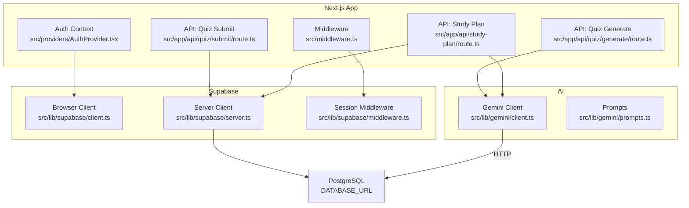
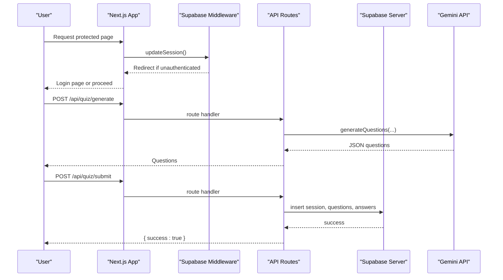
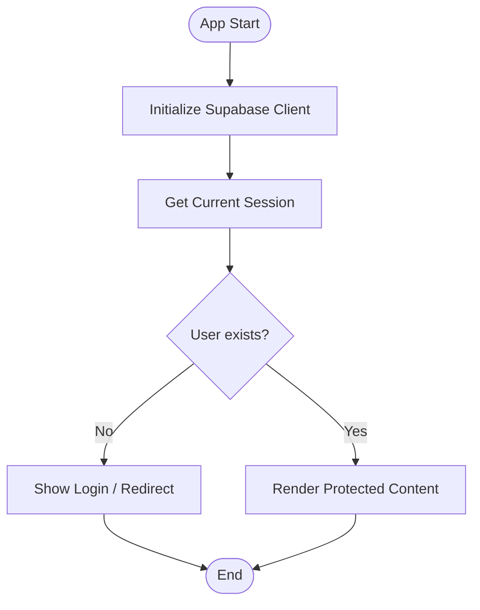
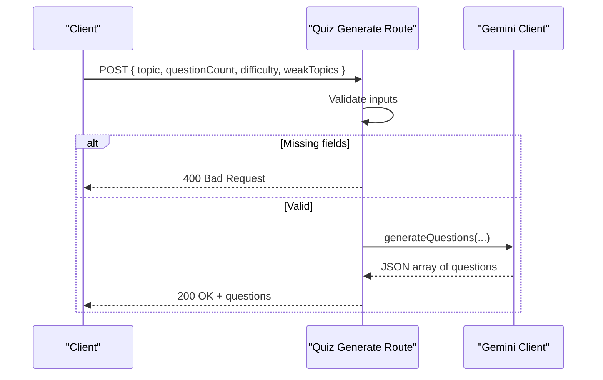
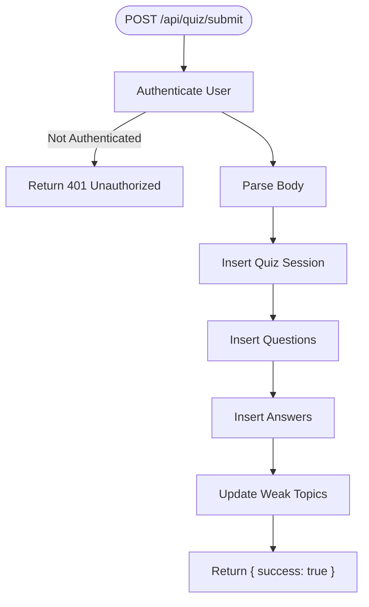
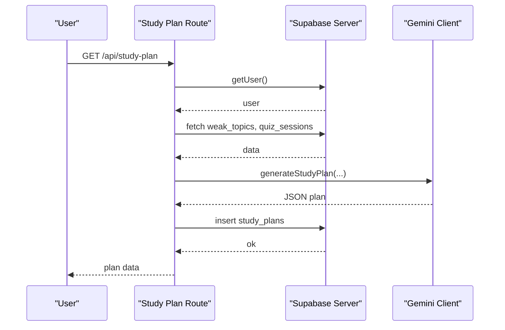
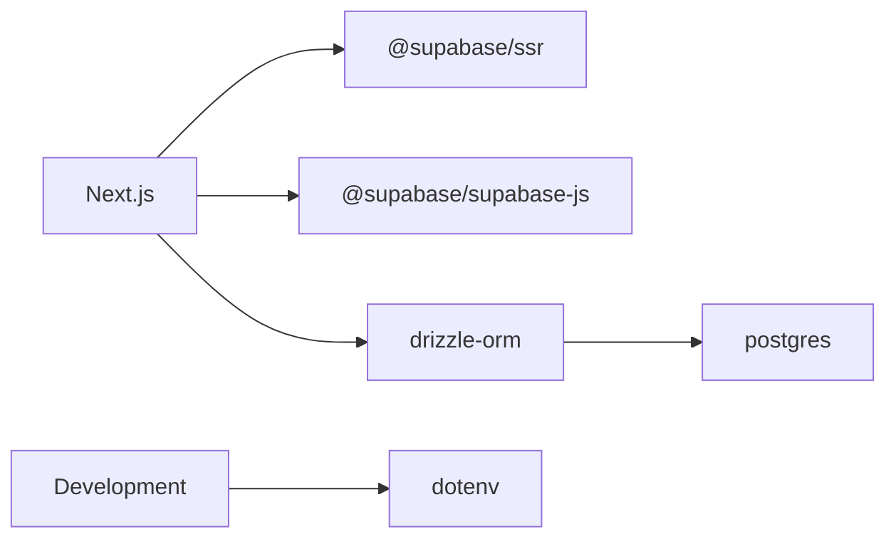

# Troubleshooting

<cite>
**Referenced Files in This Document**
- [middleware.ts](file://Next-app/src/middleware.ts)
- [AuthProvider.tsx](file://Next-app/src/providers/AuthProvider.tsx)
- [client.ts (Supabase client)](file://Next-app/src/lib/supabase/client.ts)
- [server.ts (Supabase server)](file://Next-app/src/lib/supabase/server.ts)
- [middleware.ts (Supabase middleware)](file://Next-app/src/lib/supabase/middleware.ts)
- [route.ts (quiz generate)](file://Next-app/src/app/api/quiz/generate/route.ts)
- [route.ts (quiz submit)](file://Next-app/src/app/api/quiz/submit/route.ts)
- [route.ts (study plan)](file://Next-app/src/app/api/study-plan/route.ts)
- [client.ts (Gemini client)](file://Next-app/src/lib/gemini/client.ts)
- [prompts.ts (Gemini prompts)](file://Next-app/src/lib/gemini/prompts.ts)
- [drizzle.config.ts](file://Next-app/drizzle.config.ts)
- [package.json](file://Next-app/package.json)
</cite>

## Table of Contents
1. Introduction
2. Project Structure
3. Core Components
4. Architecture Overview
5. Detailed Component Analysis
6. Dependency Analysis
7. Performance Considerations
8. Troubleshooting Guide
9. Conclusion
10. Appendices

## Introduction
This document provides a comprehensive troubleshooting guide for the MedAce-AI Next.js application. It focuses on common issues and their solutions across authentication, API integrations, database connectivity, and performance. It also includes debugging strategies for Next.js, Supabase connectivity problems, Gemini API rate limiting, memory leaks, log analysis techniques, browser developer tools usage, and production debugging approaches.

## Project Structure
The application is a Next.js app with:
- Route handlers under src/app/api for quiz generation, submission, and study plan management
- Supabase integration via SSR-enabled clients for both browser and server contexts
- Middleware to manage sessions and protect routes
- Gemini API integration for question and study plan generation
- Drizzle configuration for PostgreSQL schema migrations

**Diagram sources**
- [middleware.ts](file://Next-app/src/middleware.ts)
- [AuthProvider.tsx](file://Next-app/src/providers/AuthProvider.tsx)
- [client.ts (Supabase client)](file://Next-app/src/lib/supabase/client.ts)
- [server.ts (Supabase server)](file://Next-app/src/lib/supabase/server.ts)
- [middleware.ts (Supabase middleware)](file://Next-app/src/lib/supabase/middleware.ts)
- [route.ts (quiz generate)](file://Next-app/src/app/api/quiz/generate/route.ts)
- [route.ts (quiz submit)](file://Next-app/src/app/api/quiz/submit/route.ts)
- [route.ts (study plan)](file://Next-app/src/app/api/study-plan/route.ts)
- [client.ts (Gemini client)](file://Next-app/src/lib/gemini/client.ts)
- [prompts.ts (Gemini prompts)](file://Next-app/src/lib/gemini/prompts.ts)

**Section sources**
- [middleware.ts](file://Next-app/src/middleware.ts)
- [package.json](file://Next-app/package.json)

## Core Components
- Authentication context and session handling:
  - Browser-side auth state and sign-out flow
  - Server-side session creation and cookie propagation
  - Middleware-based route protection and redirects
- API endpoints:
  - Quiz generation via Gemini
  - Quiz submission and persistence to Supabase
  - Study plan generation and retrieval
- External integrations:
  - Supabase client setup for browser and server
  - Gemini API calls for content generation
  - Database configuration via Drizzle

**Section sources**
- [AuthProvider.tsx](file://Next-app/src/providers/AuthProvider.tsx)
- [client.ts (Supabase client)](file://Next-app/src/lib/supabase/client.ts)
- [server.ts (Supabase server)](file://Next-app/src/lib/supabase/server.ts)
- [middleware.ts (Supabase middleware)](file://Next-app/src/lib/supabase/middleware.ts)
- [route.ts (quiz generate)](file://Next-app/src/app/api/quiz/generate/route.ts)
- [route.ts (quiz submit)](file://Next-app/src/app/api/quiz/submit/route.ts)
- [route.ts (study plan)](file://Next-app/src/app/api/study-plan/route.ts)
- [client.ts (Gemini client)](file://Next-app/src/lib/gemini/client.ts)

## Architecture Overview
The request lifecycle involves:
- Incoming requests pass through Next.js middleware to update or validate sessions
- Protected routes redirect unauthenticated users to login
- API routes authenticate via Supabase server client and persist data
- AI features call Gemini to generate content based on user context and weak topics

**Diagram sources**
- [middleware.ts (Supabase middleware)](file://Next-app/src/lib/supabase/middleware.ts)
- [route.ts (quiz generate)](file://Next-app/src/app/api/quiz/generate/route.ts)
- [route.ts (quiz submit)](file://Next-app/src/app/api/quiz/submit/route.ts)
- [server.ts (Supabase server)](file://Next-app/src/lib/supabase/server.ts)
- [client.ts (Gemini client)](file://Next-app/src/lib/gemini/client.ts)

## Detailed Component Analysis

### Authentication Flow and Session Management
- Browser context initializes Supabase client and subscribes to auth state changes
- Server context creates a Supabase server client using cookies for session continuity
- Middleware enforces route protection and redirects based on authentication status

**Diagram sources**
- [AuthProvider.tsx](file://Next-app/src/providers/AuthProvider.tsx)
- [client.ts (Supabase client)](file://Next-app/src/lib/supabase/client.ts)
- [server.ts (Supabase server)](file://Next-app/src/lib/supabase/server.ts)
- [middleware.ts (Supabase middleware)](file://Next-app/src/lib/supabase/middleware.ts)

**Section sources**
- [AuthProvider.tsx](file://Next-app/src/providers/AuthProvider.tsx)
- [client.ts (Supabase client)](file://Next-app/src/lib/supabase/client.ts)
- [server.ts (Supabase server)](file://Next-app/src/lib/supabase/server.ts)
- [middleware.ts (Supabase middleware)](file://Next-app/src/lib/supabase/middleware.ts)

### Quiz Generation API (Gemini Integration)
- Validates input parameters before calling Gemini
- Parses JSON response from Gemini; handles malformed responses
- Returns errors with appropriate HTTP status codes

**Diagram sources**
- [route.ts (quiz generate)](file://Next-app/src/app/api/quiz/generate/route.ts)
- [client.ts (Gemini client)](file://Next-app/src/lib/gemini/client.ts)

**Section sources**
- [route.ts (quiz generate)](file://Next-app/src/app/api/quiz/generate/route.ts)
- [client.ts (Gemini client)](file://Next-app/src/lib/gemini/client.ts)

### Quiz Submission and Data Persistence
- Authenticates user via Supabase server client
- Inserts quiz session, questions, and answers into Supabase
- Updates weak topics based on incorrect answers

**Diagram sources**
- [route.ts (quiz submit)](file://Next-app/src/app/api/quiz/submit/route.ts)
- [server.ts (Supabase server)](file://Next-app/src/lib/supabase/server.ts)

**Section sources**
- [route.ts (quiz submit)](file://Next-app/src/app/api/quiz/submit/route.ts)
- [server.ts (Supabase server)](file://Next-app/src/lib/supabase/server.ts)

### Study Plan Generation and Retrieval
- Fetches weak topics and recent accuracy from Supabase
- Calls Gemini to generate a weekly study plan
- Persists generated plan to database and returns structured data

**Diagram sources**
- [route.ts (study plan)](file://Next-app/src/app/api/study-plan/route.ts)
- [server.ts (Supabase server)](file://Next-app/src/lib/supabase/server.ts)
- [client.ts (Gemini client)](file://Next-app/src/lib/gemini/client.ts)

**Section sources**
- [route.ts (study plan)](file://Next-app/src/app/api/study-plan/route.ts)
- [client.ts (Gemini client)](file://Next-app/src/lib/gemini/client.ts)

## Dependency Analysis
Key dependencies and their roles:
- @supabase/ssr and @supabase/supabase-js: Enable authenticated sessions and data access
- next: Framework for routing, middleware, and server components
- drizzle-orm and drizzle-kit: Schema management and migrations for PostgreSQL
- postgres: Driver for database connectivity
- dotenv: Environment variable loading during development

**Diagram sources**
- [package.json](file://Next-app/package.json)
- [drizzle.config.ts](file://Next-app/drizzle.config.ts)

**Section sources**
- [package.json](file://Next-app/package.json)
- [drizzle.config.ts](file://Next-app/drizzle.config.ts)

## Performance Considerations
- Minimize redundant API calls by caching results where appropriate
- Use efficient queries in Supabase (select only needed fields, limit results)
- Avoid large payloads in Gemini prompts; keep them concise and focused
- Monitor network latency to external APIs (Gemini) and implement retries/backoff
- Profile serverless functions for cold start times and optimize initialization logic

[No sources needed since this section provides general guidance]

## Troubleshooting Guide

### Authentication Problems
Symptoms:
- Users are redirected to login unexpectedly
- Protected pages show blank or error states
- Sign-in/sign-out does not persist

Checklist:
- Verify environment variables for Supabase URL and anon key are set correctly in both client and server contexts
- Ensure middleware is active and matches the correct paths
- Confirm that cookies are being read/written properly in server components and API routes
- Check that the auth provider initializes the client and subscribes to auth state changes

Diagnostic steps:
- Inspect browser console for errors thrown when creating the Supabase client
- Review server logs for session creation failures or missing cookies
- Test protected routes directly to see if redirects occur as expected

Resolution steps:
- Set NEXT_PUBLIC_SUPABASE_URL and NEXT_PUBLIC_SUPABASE_ANON_KEY in .env.local
- Ensure middleware matcher excludes static assets and favicon
- Rebuild and restart the dev server after updating environment variables

**Section sources**
- [client.ts (Supabase client)](file://Next-app/src/lib/supabase/client.ts)
- [server.ts (Supabase server)](file://Next-app/src/lib/supabase/server.ts)
- [middleware.ts (Supabase middleware)](file://Next-app/src/lib/supabase/middleware.ts)
- [middleware.ts](file://Next-app/src/middleware.ts)
- [AuthProvider.tsx](file://Next-app/src/providers/AuthProvider.tsx)

### API Integration Errors (Quiz Generate/Submit/Study Plan)
Symptoms:
- 400 Bad Request when generating quizzes
- 500 Internal Server Error on submit or study plan generation
- Invalid JSON responses from Gemini causing parsing failures

Checklist:
- Validate required fields in request bodies (topic, questionCount, etc.)
- Ensure Gemini API key is configured and accessible in server-side code
- Handle non-OK responses from Gemini with meaningful error messages
- Confirm Supabase tables exist and have correct schemas for inserts

Diagnostic steps:
- Log request payloads and responses in route handlers
- Capture and inspect Gemini response structure to ensure JSON extraction works
- Verify Supabase credentials and permissions for table writes

Resolution steps:
- Add robust input validation and return clear 400 errors
- Implement retry logic with exponential backoff for Gemini API failures
- Align Supabase schema with expected fields in route handlers

**Section sources**
- [route.ts (quiz generate)](file://Next-app/src/app/api/quiz/generate/route.ts)
- [route.ts (quiz submit)](file://Next-app/src/app/api/quiz/submit/route.ts)
- [route.ts (study plan)](file://Next-app/src/app/api/study-plan/route.ts)
- [client.ts (Gemini client)](file://Next-app/src/lib/gemini/client.ts)

### Database Connection Issues (Supabase/PostgreSQL)
Symptoms:
- Failed inserts or selects in Supabase
- Drizzle migrations fail or cannot connect
- Timeouts or connection refused errors

Checklist:
- Confirm DATABASE_URL is set and points to the correct PostgreSQL instance
- Verify Supabase project settings allow the requested operations (RLS policies, table permissions)
- Ensure Drizzle schema matches actual database schema

Diagnostic steps:
- Run Drizzle migrations locally to validate connectivity
- Test Supabase queries using the Supabase dashboard or CLI
- Check server logs for detailed error messages from Supabase client

Resolution steps:
- Correct DATABASE_URL and network access settings
- Adjust RLS policies to permit authenticated users to read/write relevant tables
- Re-run migrations if schema drift occurs

**Section sources**
- [drizzle.config.ts](file://Next-app/drizzle.config.ts)
- [route.ts (quiz submit)](file://Next-app/src/app/api/quiz/submit/route.ts)
- [route.ts (study plan)](file://Next-app/src/app/api/study-plan/route.ts)

### Performance Bottlenecks
Symptoms:
- Slow quiz generation or study plan creation
- High memory usage or frequent garbage collection pauses
- Network timeouts to Gemini API

Checklist:
- Measure time spent in Gemini calls and Supabase queries
- Reduce payload sizes and avoid unnecessary computations in route handlers
- Cache frequently accessed data (e.g., weak topics) where appropriate

Diagnostic steps:
- Use Next.js built-in logging and profiling to identify slow segments
- Monitor memory usage in production deployments
- Analyze network waterfall in browser dev tools for frontend bottlenecks

Resolution steps:
- Optimize prompts to reduce token usage and response size
- Implement pagination or limits for large datasets
- Add retries and circuit breakers for external API calls

**Section sources**
- [client.ts (Gemini client)](file://Next-app/src/lib/gemini/client.ts)
- [route.ts (study plan)](file://Next-app/src/app/api/study-plan/route.ts)

### Debugging Strategies for Next.js Applications
- Enable verbose logging in development mode
- Use React DevTools to inspect component state and props
- Leverage Next.js router events to trace navigation and data fetching
- Inspect server logs for runtime errors in API routes

**Section sources**
- [package.json](file://Next-app/package.json)

### Supabase Connectivity Issues
Symptoms:
- Auth state not updating
- Cookies not persisted between requests
- Server components cannot read user session

Checklist:
- Ensure createServerClient is used in server contexts with proper cookie handling
- Confirm middleware updates session cookies on each request
- Validate that environment variables are loaded at runtime

Resolution steps:
- Reinitialize Supabase clients after environment changes
- Clear browser cookies and re-authenticate
- Verify CORS and domain settings in Supabase project

**Section sources**
- [server.ts (Supabase server)](file://Next-app/src/lib/supabase/server.ts)
- [middleware.ts (Supabase middleware)](file://Next-app/src/lib/supabase/middleware.ts)

### Gemini API Rate Limiting
Symptoms:
- 429 Too Many Requests from Gemini
- Intermittent failures during high load
- Excessive token usage leading to quota exhaustion

Checklist:
- Implement retry with exponential backoff
- Add rate limiting per user or globally
- Optimize prompts to reduce token consumption

Resolution steps:
- Queue requests and process them sequentially under rate limits
- Cache repeated prompts or results where feasible
- Monitor API quotas and adjust usage patterns

**Section sources**
- [client.ts (Gemini client)](file://Next-app/src/lib/gemini/client.ts)

### Memory Leaks
Symptoms:
- Increasing memory usage over time
- Slower response times as the app runs longer
- Frequent crashes or out-of-memory errors in production

Checklist:
- Ensure event subscriptions (e.g., auth state change) are unsubscribed on cleanup
- Avoid retaining large objects in closures or global state
- Profile heap snapshots to identify retained references

Resolution steps:
- Unsubscribe from all listeners in useEffect cleanup
- Release resources after API calls complete
- Use lightweight data structures and avoid unnecessary deep copies

**Section sources**
- [AuthProvider.tsx](file://Next-app/src/providers/AuthProvider.tsx)

### Log Analysis Techniques
- Centralize logs in API routes for consistent formatting
- Include correlation IDs to trace requests across services
- Filter logs by severity and endpoint for faster diagnosis

Best practices:
- Log errors with stack traces in development
- Mask sensitive information in production logs
- Aggregate logs using a logging service for better visibility

**Section sources**
- [route.ts (quiz generate)](file://Next-app/src/app/api/quiz/generate/route.ts)
- [route.ts (quiz submit)](file://Next-app/src/app/api/quiz/submit/route.ts)
- [route.ts (study plan)](file://Next-app/src/app/api/study-plan/route.ts)

### Browser Developer Tools Usage
- Network tab: Inspect request/response headers, payloads, and timing
- Console: View JavaScript errors and warnings
- Application tab: Check cookies, local storage, and Supabase client initialization
- Performance tab: Identify long tasks and memory spikes

**Section sources**
- [client.ts (Supabase client)](file://Next-app/src/lib/supabase/client.ts)

### Production Debugging Approaches
- Enable error tracking and alerting
- Use feature flags to roll back problematic changes quickly
- Reproduce issues with production-like environments and data sets

**Section sources**
- [package.json](file://Next-app/package.json)

## Conclusion
This troubleshooting guide covers the most common issues encountered in the MedAce-AI application, including authentication, API integrations, database connectivity, and performance. By following the diagnostic steps and resolution guides, developers can efficiently identify and fix problems in both development and production environments.

[No sources needed since this section summarizes without analyzing specific files]

## Appendices

### Diagnostic Commands
- Development server:
  - npm run dev
- Build and start:
  - npm run build
  - npm start
- Lint:
  - npm run lint

**Section sources**
- [package.json](file://Next-app/package.json)

### Error Message Interpretation
- 400 Bad Request: Missing or invalid input fields in API requests
- 401 Unauthorized: Unauthenticated access to protected routes or APIs
- 500 Internal Server Error: Unexpected server-side errors (e.g., Gemini API failure, database write errors)
- 429 Too Many Requests: Rate limiting from Gemini API

**Section sources**
- [route.ts (quiz generate)](file://Next-app/src/app/api/quiz/generate/route.ts)
- [route.ts (quiz submit)](file://Next-app/src/app/api/quiz/submit/route.ts)
- [route.ts (study plan)](file://Next-app/src/app/api/study-plan/route.ts)
- [client.ts (Gemini client)](file://Next-app/src/lib/gemini/client.ts)